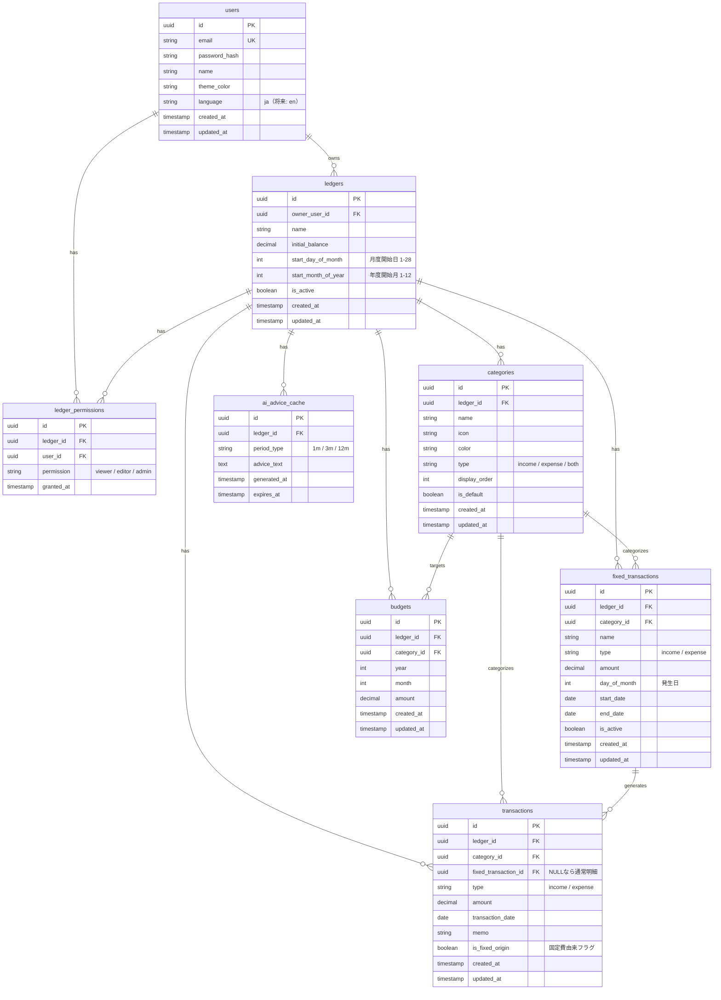

# Web版 家計簿管理アプリ「MoneyNote Web」
## AI駆動開発 プロジェクト企画書 v2.0

**作成日：** 2026年4月  
**対象：** 上司レビュー用・確定版  
**開発スタイル：** AIエージェント駆動開発（Claude Code）  
**リポジトリ構成：** モノレポ（frontend/ + backend/ を1リポジトリで管理）

---

## 目次

1. [プロジェクト概要](#1-プロジェクト概要)
2. [システム概要](#2-システム概要)
3. [機能定義](#3-機能定義)
4. [UI設計](#4-ui設計)
5. [技術スタック](#5-技術スタック)
6. [DB設計](#6-db設計)
7. [AIエージェント開発の土台](#7-aiエージェント開発の土台)
8. [実装計画](#8-実装計画)
9. [習得できる技術領域](#9-習得できる技術領域)
10. [懸念点・リスクと対策](#10-懸念点リスクと対策)
11. [開始前チェックリスト](#11-開始前チェックリスト)

---

## 1. プロジェクト概要

### 1.1 背景・目的

スマホアプリ「シンプル家計簿 MoneyNote」（株式会社コモレビ）は、シンプルな操作性と充実した分析機能で多くのユーザーに支持されている。しかし同アプリはスマートフォン専用であり、PCブラウザから利用できるWeb版は存在しない。

本プロジェクトでは、MoneyNoteのコンセプト（シンプル・続けやすい・分析が充実）を踏襲しつつ、**Webブラウザから使える家計簿管理アプリ**を開発する。

また本プロジェクトの主目的は、**Claude Codeを用いたAI駆動開発の実践的習得**であり、要件定義・設計・実装・レビュー・運用保守・エンハンスの全工程をAIエージェントに担わせ、人間は意思決定と承認に徹するスタイルで進める。

### 1.2 開発スタイルの定義

```
【従来の開発】
人間がコードを書く → AIに質問する（補助的）

【本プロジェクトの開発スタイル】
AIエージェントがコードを書く → 人間が承認する（ディレクター）
```

| 役割 | 担当 |
|---|---|
| 要件定義・仕様策定 | 人間（最終承認）＋ AIエージェント（案の提示） |
| 設計・アーキテクチャ | AIエージェント（アーキテクトロール） |
| 実装・テストコード生成 | AIエージェント（エンジニアロール） |
| コードレビュー | AIエージェント（レビュアーロール） |
| セキュリティチェック | AIエージェント（SREロール） |
| リファクタリング | AIエージェント（リファクタロール） |
| エンハンス計画 | AIエージェント（PMロール）＋ 人間（承認） |
| 動作確認・最終判断 | **人間のみ** |

### 1.3 人間の承認ゲート（3段階）

AIが自律的に動く中で、人間が必ず確認・承認するポイントを定義する。

```
Gate 1｜設計承認
  /design コマンドで設計書を生成
  → 人間が内容を確認・「OK」と入力
  → 承認後に実装を指示する

Gate 2｜コード承認
  /implement で実装・テストを生成
  → ./gradlew test / npm test がグリーンか確認
  → コードを読んで違和感がないか確認
  → OKならGitにコミット

Gate 3｜動作確認
  docker compose up で起動
  → ブラウザで実際に操作して確認
  → seed.sh でリセットして再確認
  → OKなら次のStepへ進む
```

---

## 2. システム概要

### 2.1 システム名

**MoneyNote Web**（仮称）

### 2.2 ターゲットユーザー

- 家計管理をPCブラウザで行いたい個人ユーザー
- 家族で家計を共有・管理したいユーザー
- スマホアプリと並行してPCでも管理したいユーザー

### 2.3 マルチアカウント・マルチ帳簿設計

#### 基本設計
- 1ユーザーが複数の帳簿を作成・管理できる
- 帳簿を切り替えることで表示内容が全て切り替わる
- 全機能は「選択中の帳簿」を軸に動作する

#### 帳簿の設定項目
| 設定項目 | 説明 |
|---|---|
| 帳簿名 | 任意の名前（例：個人家計簿、家族共有帳簿） |
| 初期残高 | 帳簿開始時点の残高（残高＝初期残高±累積収支） |
| 月度の開始日 | 月の区切り日（1〜28日で設定可能） |
| 年度の開始月 | 年度の区切り月（1〜12月で設定可能） |
| カテゴリ設定 | 帳簿ごとにカテゴリをカスタマイズ |
| グラフ表示順 | カテゴリの表示順をドラッグで並び替え |

#### 残高の計算方式（両方実装）
```
繰り越し残高 = 前月末残高を自動引き継ぎ
累積残高     = 初期残高 ± 累積収支で常時計算
```

#### 将来Todo：帳簿共有（権限管理）
```
【設計方針】
現時点ではDB設計のみ拡張可能な構造で実装し、
UIは将来のエンハンスで対応する。

帳簿オーナー → 他のアカウントに権限を付与
  ・閲覧権限：明細・レポートの参照のみ
  ・編集権限：明細の追加・編集・削除も可能
  ・管理権限：カテゴリ・設定の変更も可能
```

---

## 3. 機能定義

### 機能一覧

| # | 機能名 | 概要 |
|---|---|---|
| ① | 収入・支出の入力・一覧管理 | 明細の記録・一覧表示・カレンダー表示 |
| ② | 月別・年別の分析レポート | 収支・繰り越し・残高の推移分析 |
| ③ | カテゴリ別集計・グラフ | 円グラフ・棒グラフ・カテゴリ別明細表示 |
| ④ | 固定費・定期収入の管理 | 定期明細の自動登録・期間設定 |
| ⑤ | 予算設定・予算オーバー警告 | カテゴリ別予算管理・アラート |
| ⑥ | CSVエクスポート・インポート | データの入出力 |
| ⑦ | AIによる支出分析・アドバイス | 傾向分析・アドバイス生成 |
| ⑧ | ダッシュボード | 全機能のハブ・今月サマリー |
| ⑨ | 設定・管理 | アカウント・帳簿・カテゴリ等の管理 |

---

### 機能① 収入・支出の入力・一覧管理

#### 何ができるか
- 収入・支出を日付・金額・カテゴリ・メモで記録する
- 表示月を前後に切り替えられる（月セレクター）
- カレンダー表示で日ごとの収支を視覚的に確認できる
- カレンダーの日付をクリックして明細を入力できる
- 明細一覧は日付グループごとに表示し、日次収支も表示する
- 明細一覧の最上部に月の収入合計・支出合計・収支を表示する

#### 役割・必要性
家計簿の根幹機能。ここに蓄積されたデータが全ての分析の基となる。カレンダー＋一覧の2つの視点で直感的に家計を把握できる。

#### 画面レイアウト（`/ledgers/:ledgerId/transactions`）

```
┌─────────────────────────────────────────────────┐
│  ＜ 2026年4月 ＞          収入 ¥280,000         │
│                           支出 ¥235,000         │
│                           収支 +¥45,000         │
├─────────────────────────────────────────────────┤
│  【カレンダー】                                  │
│  月  火  水  木  金  土  日                      │
│  ...  1    2    3    4    5                     │
│       -    -    -  +1,200  -                   │
│   6    7    8  ...                              │
│  -540  -    -                                   │
│  （支出のある日は赤・収入のある日は青で表示）      │
├─────────────────────────────────────────────────┤
│  【明細一覧】                          [＋ 追加] │
├─────────────────────────────────────────────────┤
│  2026/04/15（火）         日次収支 -¥1,200       │
│  🍔 食費  ランチ            -¥1,200  [編集][削除]│
├─────────────────────────────────────────────────┤
│  2026/04/14（月）         日次収支 -¥540         │
│  🚃 交通費  定期外           -¥540   [編集][削除]│
├─────────────────────────────────────────────────┤
│  2026/04/10（木）         日次収支 +¥280,000     │
│  💰 給与   4月分給与      +¥280,000  [編集][削除]│
└─────────────────────────────────────────────────┘
```

#### 明細入力フォーム（モーダルまたはサイドパネル）
```
┌────────────────────────────────────┐
│  明細を追加          [×]           │
├────────────────────────────────────┤
│  種別   ● 支出  ○ 収入            │
│  日付   2026/04/15                 │
│  金額   ¥ [___________]            │
│  カテゴリ  [食費         ▼]       │
│  メモ   [___________________]      │
│  固定費  □ 固定費として登録         │
├────────────────────────────────────┤
│         [キャンセル]  [保存]       │
└────────────────────────────────────┘
```

---

### 機能② 月別・年別の分析レポート

#### 何ができるか
- 月ごとの収入・支出・収支・繰り越し・残高を数値表示する
- 年間の月別推移をグラフで表示する（棒グラフ）
- 前月・前年同月との比較を表示する
- 繰り越し残高：前月末残高を自動引き継ぎ
- 累積残高：初期残高±累積収支で常時計算

#### 役割・必要性
「今月はいくら使ったか」「お金は増えているのか減っているのか」を時系列で把握できる。残高推移を見ることで家計全体の健全性が判断できる。

#### 画面レイアウト（`/ledgers/:ledgerId/reports`）

```
┌──────────────────────────────────────────────────┐
│  分析レポート  [月別 | 年別]  ＜ 2026年4月 ＞    │
├──────────────────────────────────────────────────┤
│  収入       ¥280,000   (前月比 +¥0)              │
│  支出       ¥235,000   (前月比 +¥12,000 ▲)      │
│  収支       +¥45,000                             │
│  繰り越し   ¥1,200,000  (3月末残高)              │
│  残高       ¥1,245,000                           │
├──────────────────────────────────────────────────┤
│  【年間月別推移グラフ（棒グラフ）】               │
│  ■収入 ■支出                                    │
│  ████ ████ ████ ████ ████ ████ ...             │
│  1月  2月  3月  4月  5月  6月                    │
├──────────────────────────────────────────────────┤
│  【残高推移グラフ（折れ線グラフ）】               │
│   ╭──╮                                          │
│  ╱    ╲                                         │
│ ╱      ╰──                                      │
│ 1月 2月 3月 4月 5月 6月                          │
└──────────────────────────────────────────────────┘
```

---

### 機能③ カテゴリ別集計・グラフ

#### 何ができるか
- 支出をカテゴリ別に集計し、円グラフで割合を表示する
- カテゴリ一覧からカテゴリを選択すると、そのカテゴリの明細一覧と月別推移棒グラフを表示する
- 明細を選択すると編集画面に遷移する
- 月切替でグラフ・集計が更新される

#### 役割・必要性
「何に一番お金を使っているか」が視覚的に把握できる。カテゴリを掘り下げることで個別の支出傾向を詳細確認できる。

#### 画面レイアウト（`/ledgers/:ledgerId/categories`）

```
┌──────────────────────────────────────────────────┐
│  カテゴリ別集計       ＜ 2026年4月 ＞            │
├────────────────────┬─────────────────────────────┤
│  【円グラフ】       │  【カテゴリ一覧】           │
│    ╭──────╮        │  🍔 食費    ¥45,000  35% >  │
│   ╱ 食費   ╲       │  🏠 住居費  ¥80,000  28% >  │
│  │ 住居費   │      │  🚃 交通費  ¥12,000  10% >  │
│   ╲ 交通費 ╱       │  💡 光熱費  ¥15,000   8% >  │
│    ╰──────╯        │  👕 衣服費   ¥8,000   6% >  │
│                    │  その他    ¥18,000  13% >  │
└────────────────────┴─────────────────────────────┘

【カテゴリ選択後のドリルダウン表示】
┌──────────────────────────────────────────────────┐
│  ← カテゴリ一覧   🍔 食費                        │
├──────────────────────────────────────────────────┤
│  【月別推移棒グラフ】                             │
│  ■ ■ ■ ■ ■ ■ ■ ■ ■ ■ ■ ■                    │
│  1月 2月 3月 4月 5月 6月 ...                     │
├──────────────────────────────────────────────────┤
│  【食費の明細一覧】                               │
│  4/15  ランチ                 -¥1,200  [編集]   │
│  4/12  スーパー               -¥4,500  [編集]   │
│  4/08  コンビニ               -¥650   [編集]   │
└──────────────────────────────────────────────────┘
```

---

### 機能④ 固定費・定期収入の管理

#### 何ができるか
- 固定費・定期収入を登録する（名称・カテゴリ・金額・発生日・開始日・終了日）
- 開始日〜終了日の範囲で毎月指定日に明細を一括自動登録する
- 固定費由来の明細は通常明細と区別して表示する（アイコン等）
- 固定費明細の削除・編集時に「この1件のみ」か「全件（過去も含む）」かを選択する

#### 削除・編集時の確認フロー
```
【削除・編集時のダイアログ】
┌────────────────────────────────────┐
│  この明細は固定費から自動登録       │
│  されたものです。どちらを対象に     │
│  しますか？                        │
│                                    │
│  ○ この1件のみ対象にする           │
│  ○ 全件を対象にする（過去も含む）  │
│                                    │
│  [キャンセル]           [実行]     │
└────────────────────────────────────┘
```

#### 役割・必要性
毎月同じ収支を手動入力する手間を省き、継続率を向上させる。固定費の総額を把握することで可処分所得が明確になる。

---

### 機能⑤ 予算設定・予算オーバー警告

#### 何ができるか
- カテゴリごとに月の予算上限を設定する
- 消化率をプログレスバーで表示する（🟢🟡🔴 の信号機カラー）
- 80%超過で🟡警告、100%超過で🔴アラートをToastで通知する
- ダッシュボードで全カテゴリの消化率を一覧表示する

#### 役割・必要性
目標設定と管理ができて初めて家計が改善する。予算オーバーへの事前気づきで月末の使いすぎを防ぐ。

---

### 機能⑥ CSVエクスポート・インポート

#### 何ができるか
- 明細データをCSV形式でエクスポートできる
- このアプリからエクスポートしたCSVをそのままインポートできる
- 正しいフォーマットのCSVのみ受け付ける（AI補正なし）
- エクスポートは期間・カテゴリでフィルタリング可能
- インポート時はバリデーションエラー行をエラーレポートで返す

#### CSVフォーマット仕様
```
date,type,amount,category,memo,is_fixed
2026-04-15,expense,1200,食費,ランチ,false
2026-04-10,income,280000,給与,4月分給与,false
```

#### 役割・必要性
データのポータビリティを確保し、ユーザーの信頼を得る。乗り換えの容易さと手元でのデータ管理ができる安心感を提供する。

---

### 機能⑦ AIによる支出分析・アドバイス

#### 何ができるか
- 直近1ヶ月・3ヶ月・12ヶ月の収支傾向を自動集計し常時表示する
- 予算と実績の比較分析（常時表示）
- 比較対象：前月・前年同月
- ユーザーのボタン操作をトリガーとして以下を実行する
  - 未来予測（来月の支出予測）
  - 自然言語によるアドバイス生成
  - 節約改善提案
- インサイト・アドバイスは常に最新データを参照して生成する

#### 常時表示（データ集計）vs ボタントリガー（AI生成）の分離
```
【常時表示（APIコストなし）】
・直近1/3/12ヶ月の収支推移グラフ
・予算vs実績の比較表
・前月比・前年比の数値

【ボタントリガー（Claude API呼び出し）】
・「分析する」ボタン → 自然言語インサイト生成
・「アドバイスを見る」ボタン → 改善提案生成
・「来月を予測する」ボタン → 来月支出予測
```

#### 画面レイアウト（`/ledgers/:ledgerId/ai`）

```
┌──────────────────────────────────────────────────┐
│  AI分析・アドバイス   期間: [1ヶ月▼]             │
├──────────────────────────────────────────────────┤
│  【収支傾向（常時表示）】                         │
│  直近3ヶ月  収入平均 ¥280,000  支出平均 ¥228,000 │
│  前月比     支出 +¥12,000 ▲                      │
│  予算消化   食費 87% / 娯楽費 115%               │
├──────────────────────────────────────────────────┤
│  【AIアドバイス（ボタントリガー）】               │
│  [🤖 今月を分析する]  [💡 改善提案を見る]         │
│  [📈 来月を予測する]                              │
│                                                  │
│  ▼ 分析結果（ボタン押下後に表示）               │
│  ┌──────────────────────────────────────────┐   │
│  │ ✅ 今月は黒字です（+¥45,000）            │   │
│  │ 📊 食費が先月比+15%増加しています。      │   │
│  │ 💡 娯楽費が予算をオーバーしています。    │   │
│  └──────────────────────────────────────────┘   │
└──────────────────────────────────────────────────┘
```

#### 役割・必要性
他の家計簿アプリとの最大の差別化ポイント。数値では気づきにくい傾向をAIが言語化する。常時表示とトリガー生成を分けることでAPIコストを最適化する。

---

### 機能⑧ ダッシュボード

#### 何ができるか
- ログイン後の最初の画面として全情報の概要を表示する
- 表示月を変更できる（月セレクター）
- 帳簿の切り替えをヘッダーから行える
- 今月の収入・支出・収支・残高サマリーを表示する
- カテゴリ別円グラフ（今月）を表示する
- 予算消化率を信号機で一覧表示する
- AIアドバイスのサマリーを表示する
- 最近の明細を表示する（デフォルト10件・変更可能）
- 各機能へのナビゲーションを提供する

#### ダッシュボード画面レイアウト（`/dashboard`）

```
┌──────────────────────────────────────────────────────────┐
│  🏦 MoneyNote Web                              [田中 👤] │
│  帳簿: [個人家計簿 ▼]        ＜ 2026年4月 ＞            │
├──────────────────────────────────────────────────────────┤
│  【サイドメニュー】 │  【メインコンテンツ】             │
│                   │                                     │
│  🏠 ダッシュボード │  ┌──────┐ ┌──────┐ ┌──────┐       │
│  💰 明細・入力     │  │収入   │ │支出   │ │収支   │       │
│  📊 レポート       │  │¥280,000│ │¥235,000│ │+¥45,000│      │
│  🥧 カテゴリ      │  └──────┘ └──────┘ └──────┘       │
│  🔁 固定費        │  ┌──────────────┐ ┌────────────┐   │
│  🎯 予算          │  │カテゴリ別支出 │ │予算消化率   │   │
│  🤖 AI分析        │  │  🥧（円グラフ）│ │食費  🟡87% │   │
│  ⚙️ 設定          │  │              │ │交通費 🟢53%│   │
│                   │  └──────────────┘ │娯楽費 🔴115│   │
│                   │                   └────────────┘   │
│                   │  ┌──────────────────────────────┐  │
│                   │  │🤖 AIサマリー    [分析する]    │  │
│                   │  │今月は黒字。食費が増加傾向。   │  │
│                   │  └──────────────────────────────┘  │
│                   │  ┌──────────────────────────────┐  │
│                   │  │最近の明細（10件）[全て見る→] │  │
│                   │  │4/15 食費 ランチ    -¥1,200   │  │
│                   │  │4/14 交通費 定期外   -¥540    │  │
│                   │  │...                           │  │
│                   │  │表示件数: [10件 ▼]            │  │
│                   │  └──────────────────────────────┘  │
└───────────────────┴──────────────────────────────────────┘
```

---

### 機能⑨ 設定・管理（統合管理画面）

#### 何ができるか
設定画面を1つに統合し、タブ切り替えで各種管理機能にアクセスできる。

#### タブ構成（`/settings`）

| タブ | 機能内容 |
|---|---|
| アカウント | メール・パスワード変更・テーマカラー設定 |
| 帳簿管理 | 帳簿の追加・編集・削除 |
| 帳簿設定 | 選択中帳簿の詳細設定（カテゴリ・開始日等） |
| レポート | 選択中帳簿の年間レポート |
| 検索 | 取引の横断検索 |
| データ管理 | CSV エクスポート・インポート |

#### 帳簿設定タブの詳細

```
┌──────────────────────────────────────────────────┐
│  設定  [アカウント][帳簿管理][帳簿設定][レポート] │
│        [検索][データ管理]                        │
├──────────────────────────────────────────────────┤
│  【帳簿設定タブ】  対象: 個人家計簿              │
│                                                  │
│  帳簿名      [個人家計簿____________]            │
│  初期残高    [¥ 1,000,000__________]            │
│  月度開始日  [1日 ▼]                            │
│  年度開始月  [1月 ▼]                            │
│                                                  │
│  【カテゴリ管理】               [＋ カテゴリ追加] │
│  🍔 食費      [編集][削除]                       │
│  🏠 住居費    [編集][削除]                       │
│  🚃 交通費    [編集][削除]  ↕ ドラッグで並び替え │
│                                                  │
│  【グラフ表示順設定】                            │
│  ドラッグでカテゴリの表示順を変更できます        │
└──────────────────────────────────────────────────┘
```

#### レポートタブの詳細

```
┌──────────────────────────────────────────────────┐
│  【レポートタブ】  対象: 個人家計簿  2026年       │
│                                                  │
│  年間収支レポート（棒グラフ）                    │
│  ■収入 ■支出                                    │
│  ████ ████ ████ ... （12ヶ月分）               │
│                                                  │
│  年間カテゴリレポート（円グラフ）                │
│  食費35% / 住居費28% / 交通費10% ...            │
│                                                  │
│  残高推移レポート（折れ線グラフ）                │
│  ╭──╮╭────╮                                    │
│ ╱    ╲╱     ╲                                   │
│ 1月  2月  3月  4月 ...                          │
└──────────────────────────────────────────────────┘
```

---

## 4. UI設計

### 4.1 デザインコンセプト

- **シンプル・直感的：** 操作方法に迷わない明快なUI
- **情報の優先順位：** 重要情報を最上部・最大サイズで表示
- **信号機モデル：** 数値を読まなくても色で状態がわかる（🟢🟡🔴）
- **画面の共通化：** 類似機能は1画面を使い回す（明細一覧/編集等）
- **レスポンシブ対応：** スマホブラウザでも使いやすい設計

### 4.2 画面一覧とパス設計

| 画面名 | パス | 説明 |
|---|---|---|
| ランディング | `/` | 未ログイン時のトップ |
| ログイン | `/login` | メール・パスワードでログイン |
| 会員登録 | `/register` | 新規アカウント作成 |
| パスワードリセット | `/password-reset` | メールでリセットリンク送信 |
| パスワード再設定 | `/password-reset/confirm` | 新パスワード設定 |
| ダッシュボード | `/dashboard` | ホーム画面（ログイン後の初期画面） |
| 明細一覧・カレンダー | `/ledgers/:ledgerId/transactions` | カレンダー＋明細一覧 |
| 明細入力（新規） | `/ledgers/:ledgerId/transactions/new` | 新規明細作成（モーダル or ページ） |
| 明細編集 | `/ledgers/:ledgerId/transactions/:id/edit` | 既存明細の編集 |
| 分析レポート | `/ledgers/:ledgerId/reports` | 月別・年別レポート |
| カテゴリ別集計 | `/ledgers/:ledgerId/categories` | 円グラフ・カテゴリ一覧 |
| カテゴリ別明細 | `/ledgers/:ledgerId/categories/:categoryId` | カテゴリ別の明細・棒グラフ |
| 固定費管理 | `/ledgers/:ledgerId/fixed` | 固定費・定期収入一覧 |
| 固定費入力（新規） | `/ledgers/:ledgerId/fixed/new` | 新規固定費登録 |
| 固定費編集 | `/ledgers/:ledgerId/fixed/:id/edit` | 既存固定費の編集 |
| 予算設定 | `/ledgers/:ledgerId/budget` | カテゴリ別予算管理 |
| AI分析 | `/ledgers/:ledgerId/ai` | AI支出分析・アドバイス |
| 設定 | `/settings` | タブ切り替えで各種設定 |
| 設定（アカウント） | `/settings?tab=account` | アカウント情報変更 |
| 設定（帳簿管理） | `/settings?tab=ledgers` | 帳簿の追加・編集・削除 |
| 設定（帳簿設定） | `/settings?tab=ledger-config` | 選択中帳簿の詳細設定 |
| 設定（レポート） | `/settings?tab=reports` | 年間レポート |
| 設定（検索） | `/settings?tab=search` | 取引の横断検索 |
| 設定（データ管理） | `/settings?tab=data` | CSV入出力 |

### 4.3 画面遷移図

```
[/] ──→ [/login] ──────────────────────────→ [/dashboard]
         │                                        │
         └→ [/register]                           ├→ [/ledgers/:id/transactions]
         └→ [/password-reset]                     │      └→ [/transactions/new]（モーダル）
                └→ [/password-reset/confirm]      │      └→ [/transactions/:id/edit]
                                                  │
                                                  ├→ [/ledgers/:id/reports]
                                                  │
                                                  ├→ [/ledgers/:id/categories]
                                                  │      └→ [/categories/:categoryId]
                                                  │           └→ [/transactions/:id/edit]（共通）
                                                  │
                                                  ├→ [/ledgers/:id/fixed]
                                                  │      └→ [/fixed/new]
                                                  │      └→ [/fixed/:id/edit]
                                                  │
                                                  ├→ [/ledgers/:id/budget]
                                                  │
                                                  ├→ [/ledgers/:id/ai]
                                                  │
                                                  └→ [/settings?tab=*]
```

### 4.4 共通化する画面・コンポーネント

| コンポーネント | 使い回す画面 |
|---|---|
| `TransactionEditForm` | `/transactions/new`・`/transactions/:id/edit`・カテゴリ別明細からの編集 |
| `TransactionList` | ダッシュボード（最近の明細）・明細一覧・カテゴリ別明細 |
| `CategoryPieChart` | ダッシュボード・カテゴリ別集計 |
| `MonthSelector` | ダッシュボード・明細一覧・レポート・カテゴリ集計 |
| `SummaryCards` | ダッシュボード・明細一覧ヘッダー |
| `BudgetProgressBar` | ダッシュボード・予算設定画面 |
| `FixedBadge` | 固定費由来の明細に付与するバッジ |

### 4.5 グローバルレイアウト

```
┌─────────────────────────────────────────────────────────┐
│ ヘッダー                                                │
│ [🏦 MoneyNote]  [帳簿: 個人家計簿 ▼]  [通知🔔] [👤]   │
├──────────┬──────────────────────────────────────────────┤
│サイドメニュー│  メインコンテンツ                         │
│          │                                              │
│🏠 ダッシュ│  （各ページのコンテンツ）                   │
│💰 明細    │                                              │
│📊 レポート│                                              │
│🥧 カテゴリ│                                              │
│🔁 固定費  │                                              │
│🎯 予算    │                                              │
│🤖 AI分析  │                                              │
│⚙️ 設定    │                                              │
│          │                                              │
└──────────┴──────────────────────────────────────────────┘
```

**スマホ時：** サイドメニューはボトムナビゲーションに変換

---

## 5. 技術スタック

### 5.1 採用スタック一覧

| カテゴリ | 技術 | バージョン | 習得できる領域 |
|---|---|---|---|
| フロントエンド | Next.js + TypeScript | 14 / 5.x | SSR・SSG・App Router |
| スタイル | Tailwind CSS | 3.x | UIデザイン・レスポンシブ |
| グラフ | Recharts | 2.x | 円・棒・折れ線グラフ |
| 状態管理 | Zustand | 4.x | クライアント状態管理 |
| フォーム | React Hook Form + Zod | — | バリデーション・型安全 |
| 国際化 | next-intl（日本語のみ・将来拡張用） | 3.x | i18n基盤 |
| バックエンド | Spring Boot + Java | 3.x / 21 | バックエンド・DI・AOP |
| REST API | Spring MVC + Springdoc | — | API設計・OpenAPI |
| 認証 | Spring Security + JWT | 6.x | セキュリティ・認証・認可 |
| AI連携 | Spring AI + Claude API | 1.x | LLM連携・エージェント |
| バッチ | Spring Batch + Redis | 5.x | 定期処理・ジョブ管理 |
| ORM | Spring Data JPA + Hibernate | — | DB操作・N+1対策 |
| DB | PostgreSQL | 16 | DB設計・正規化 |
| DBマイグレーション | Flyway | 9.x | スキーマバージョン管理 |
| キャッシュ | Redis | 7.x | セッション・キャッシュ |
| CSV処理 | Apache Commons CSV | 1.x | CSV入出力 |
| テスト（BE） | JUnit5 + Testcontainers + MockMvc | — | 単体・結合テスト |
| テスト（FE） | Jest + React Testing Library | — | コンポーネントテスト |
| メール（開発） | Mailhog | — | メール確認（無料） |
| インフラ | Docker Compose | — | コンテナ・ネットワーク |
| CI | GitHub Actions | — | CI/CDパイプライン |
| コード品質 | Checkstyle + ESLint + Prettier | — | コード規約・品質管理 |

### 5.2 モノレポ構成

```
moneynote-web/                ← GitHub リポジトリルート
├── CLAUDE.md                 ← エージェントへの憲法（最重要）
├── AGENTS.md                 ← 役割別エージェント定義
├── .claude/
│   ├── commands/             ← Claude Code カスタムコマンド
│   │   ├── design.md
│   │   ├── implement.md
│   │   ├── frontend.md
│   │   ├── review.md
│   │   ├── security.md
│   │   ├── test.md
│   │   ├── refactor.md
│   │   └── ops.md
│   └── settings.json         ← Claude Code Rules設定
├── docker-compose.yml
├── seed.sh                   ← ワンコマンドでデータリセット
├── .env.example
├── .gitignore
├── docs/
│   ├── architecture.md       ← システム構成図
│   ├── screen-design.md      ← 画面設計書（本資料の内容）
│   ├── api-spec.md           ← API仕様書
│   └── decisions/            ← 設計判断記録（ADR）
│       └── 001-monorepo.md
├── backend/                  ← Spring Boot
│   ├── build.gradle
│   ├── src/main/java/com/example/moneynote/
│   │   ├── MoneynoteApplication.java
│   │   ├── config/           ← Security・CORS・Batch設定
│   │   ├── domain/           ← Entity・Repository・Service
│   │   │   ├── user/
│   │   │   ├── ledger/
│   │   │   ├── transaction/
│   │   │   ├── category/
│   │   │   ├── budget/
│   │   │   ├── fixed/
│   │   │   └── ai/
│   │   ├── api/              ← Controller・DTO・Validator
│   │   ├── batch/            ← Spring Batch Job定義
│   │   ├── common/           ← 共通例外・レスポンス形式
│   │   └── infrastructure/   ← 外部API・CSV処理
│   └── src/test/
└── frontend/                 ← Next.js
    ├── package.json
    └── src/
        ├── app/              ← App Router ページ
        │   ├── (auth)/       ← 認証不要ページ群
        │   │   ├── login/
        │   │   ├── register/
        │   │   └── password-reset/
        │   ├── (app)/        ← 認証必要ページ群
        │   │   ├── dashboard/
        │   │   ├── ledgers/
        │   │   │   └── [ledgerId]/
        │   │   │       ├── transactions/
        │   │   │       ├── reports/
        │   │   │       ├── categories/
        │   │   │       ├── fixed/
        │   │   │       ├── budget/
        │   │   │       └── ai/
        │   │   └── settings/
        │   └── layout.tsx
        ├── components/       ← 共通コンポーネント
        │   ├── ui/           ← 汎用UIパーツ
        │   ├── transaction/  ← 明細関連コンポーネント
        │   ├── charts/       ← グラフコンポーネント
        │   └── layout/       ← レイアウトコンポーネント
        ├── hooks/            ← カスタムフック
        ├── stores/           ← Zustand ストア
        ├── lib/              ← APIクライアント・ユーティリティ
        └── types/            ← 型定義
```

### 5.3 インフラ構成

```
┌─────────────────────────────────────────────────────┐
│                  Docker Compose                     │
│                                                     │
│  ┌──────────────┐    ┌──────────────────────────┐  │
│  │  Next.js 14  │    │    Spring Boot 3.x        │  │
│  │  TypeScript  │◀──▶│    Java 21                │  │
│  │  Tailwind    │    │    Spring Security + JWT  │  │
│  │  :3000       │    │    Spring AI              │  │
│  └──────────────┘    │    Spring Batch           │  │
│                      │    :8080                  │  │
│  ┌──────────────┐    └────────────┬─────────────┘  │
│  │  PostgreSQL  │◀────────────────┤                 │
│  │  16          │                 │                 │
│  │  :5432       │    ┌────────────┴─────────────┐  │
│  └──────────────┘    │  Redis 7                 │  │
│                      │  Batch Queue + Session   │  │
│  ┌──────────────┐    │  :6379                   │  │
│  │  Mailhog     │    └──────────────────────────┘  │
│  │  :8025       │                                   │
│  └──────────────┘         ↕ Claude API（外部）     │
└─────────────────────────────────────────────────────┘
```

---

## 6. DB設計

### 6.1 ER図（Mermaid）



### 6.2 設計のポイント

| 設計判断 | 内容 |
|---|---|
| UUID採用 | 全テーブルのPKをUUIDにしてセキュリティ・分散対応 |
| 帳簿スコープ | カテゴリ・明細・予算・固定費は全て帳簿に紐づく |
| 権限管理テーブル | `ledger_permissions` で将来の帳簿共有に対応 |
| 固定費の追跡 | `fixed_transaction_id` で固定費由来明細を追跡 |
| AIキャッシュ | `ai_advice_cache` でAPI呼び出しを最小化 |
| 残高計算 | DBに残高カラムを持たず毎回 `初期残高 ± 累積収支` で計算 |

---

## 7. AIエージェント開発の土台

### 7.1 CLAUDE.md（確定全文）

```markdown
# CLAUDE.md - エージェントへの憲法

このファイルはClaude Codeが常時参照する最重要ファイル。
実装前に必ずこのファイルを読み、全ての方針に従うこと。

---

## プロジェクト概要
MoneyNote Web - Web版家計簿管理アプリ（モノレポ構成）
マルチアカウント・マルチ帳簿対応

## リポジトリ構成
- モノレポ: moneynote-web/
  - backend/  ← Spring Boot 3.x / Java 21
  - frontend/ ← Next.js 14 / TypeScript

## 技術スタック
### Backend
- Spring Boot 3.x / Java 21
- Spring Security + JWT（アクセス15分・リフレッシュ7日）
- Spring AI + Claude API（モック切替対応）
- Spring Batch + Redis（定期処理・ジョブキュー）
- Spring Data JPA + Hibernate
- PostgreSQL 16 / Flyway
- Apache Commons CSV
- JUnit5 + Testcontainers + MockMvc

### Frontend
- Next.js 14 / TypeScript / Tailwind CSS
- Zustand（状態管理）
- React Hook Form + Zod（フォーム・バリデーション）
- Recharts（グラフ）
- Jest + React Testing Library

## アーキテクチャ原則
1. レイヤードアーキテクチャを厳守: Controller → Service → Repository
2. ドメインロジックはServiceに集約（ControllerとRepositoryに書かない）
3. 全APIは /api/v1/ プレフィックスを付ける
4. 全APIは帳簿IDによるアクセス制御を必ず実装する
5. 重い処理（AI呼び出し・CSV処理）は必ずSpring Batchで非同期化
6. AIはモック切替可能（application-dev.yml の ai.mock=true）

## セキュリティ必須ルール
- パスワード: BCryptでハッシュ化（強度12）
- JWT: アクセストークン15分 / リフレッシュトークン7日（Redis管理）
- 全APIエンドポイントにJWT認証を要求する
- 帳簿アクセス: 必ずログインユーザーが帳簿の権限を持つか検証
- SQLインジェクション: JPQL or CriteriaAPI使用（ネイティブSQL禁止）
- 機密情報（パスワード・トークン）をログに出力しない
- セキュリティ変更時は理由をコメントに記載

## コーディング規約
### Java
- クラス名: UpperCamelCase
- メソッド名・変数名: lowerCamelCase
- 定数: UPPER_SNAKE_CASE
- パッケージ: com.example.moneynote.{layer}.{domain}
- 例外: カスタム例外クラスを使う（RuntimeException直接使用禁止）
- レスポンス形式: { data, error, timestamp }
- エラーコード: E001, E002 ... の体系で管理

### TypeScript
- any型の使用禁止
- コンポーネント: アロー関数で定義
- ESLint + Prettier の設定に必ず従う
- APIクライアント: lib/api/ に集約

## テスト必須ルール
- 全Serviceクラスに対してJUnit5テストを作成する
- DBを使うテストはTestcontainersを使用する
- MockMvcで全APIエンドポイントのテストを作成する
- テストカバレッジ目標: 80%以上
- テストなしの実装は行わない

## エージェント行動ルール
1. 実装前に必ず設計をMarkdown形式で出力し承認を待つ
2. 不明点があれば実装を止めて質問リストを出力する
3. 一度に変更するファイルは最大5ファイルまで
4. 実装とテストは必ずセットで作成する
5. エラー時: 原因・影響範囲・修正方針を説明してから修正する
6. 機能追加時: 既存テストが全てグリーンのまま完了させる

## ローカル環境
- 起動: docker compose up -d
- リセット: ./seed.sh
- フロント: http://localhost:3000
- API/Swagger: http://localhost:8080/swagger-ui.html
- メール: http://localhost:8025
```

### 7.2 Claude Code カスタムコマンド一覧

`.claude/commands/` ディレクトリに定義。`/コマンド名` で呼び出す。

| コマンド | ロール | 用途 | 出力物 |
|---|---|---|---|
| `/design [機能名]` | アーキテクト | 設計書・ER図・API仕様の生成 | Markdown設計書・Mermaid図 |
| `/implement [設計書パス]` | バックエンドエンジニア | 設計書に基づくBE実装 | Javaコード＋JUnit5テスト |
| `/frontend [仕様]` | フロントエンドエンジニア | Next.jsコンポーネント・画面実装 | TypeScriptコード＋テスト |
| `/review` | シニアレビュアー | コードレビュー | Critical/Major/Minor 指摘リスト |
| `/security` | SRE | セキュリティ診断 | OWASP観点の診断レポート |
| `/test [対象]` | QAエンジニア | テスト追加・カバレッジ向上 | テストコード |
| `/refactor` | リファクタエンジニア | 品質改善（機能変更なし） | リファクタ済みコード |
| `/ops [エラー内容]` | 運用エンジニア | エラー分析・修正提案 | 原因分析レポート |
| `/seed [内容]` | データエンジニア | seed.shの更新・拡充 | seed.sh追記内容 |

**コマンド使用例：**
```bash
# Step 1のDB設計
/design ユーザー・帳簿・権限管理のDB設計（ER図をMermaid形式で出力）

# 設計承認後の実装
/implement docs/decisions/001-db-design.md

# 実装後のレビュー
/review

# セキュリティチェック
/security
```

### 7.3 Claude Code Rules（settings.json）

```json
{
  "rules": [
    "実装前に必ず設計書をMarkdownで出力し、ユーザーの承認（'OK'の入力）を待つ",
    "テストコードなしの実装コードは絶対に生成しない",
    "帳簿へのアクセス制御（ログインユーザーの権限確認）を必ず実装する",
    "セキュリティに関わる変更は理由をコメントに記載する",
    "日本語でコメント・ドキュメントを記述する",
    "エラー発生時は原因・影響範囲・修正方針を説明してから修正する",
    "一度に変更するファイルは最大5ファイルまでとする"
  ],
  "permissions": {
    "allow": ["Bash", "Read", "Write"],
    "deny": []
  }
}
```

### 7.4 役割別エージェント定義（AGENTS.md抜粋）

```markdown
# AGENTS.md

## ロール定義

### アーキテクト
責務: 技術選定・設計書・ER図・シーケンス図の作成
制約: コードを書かない。承認前に実装を始めない。
出力: Markdown設計書・Mermaid図・ADR

### バックエンドエンジニア
責務: Spring Boot実装・API実装・バッチ実装・テスト
制約: 設計書が承認された後にのみ実装する。テスト同時作成必須。
出力: Javaコード・JUnit5テスト・Flywayマイグレーション

### フロントエンドエンジニア
責務: Next.jsコンポーネント・画面・APIクライアント実装
制約: any型禁止。共通コンポーネントを積極的に再利用する。
出力: TypeScriptコード・テスト

### シニアレビュアー
責務: コードレビュー・品質チェック
制約: 実装はしない。指摘事項のみ出力。
出力: Critical/Major/Minorの優先度付き指摘リスト

### SRE
責務: セキュリティ診断・運用設計・CI/CD構築
制約: 本番データを変更しない。
出力: 診断レポート・修正方針・運用手順書

### リファクタエンジニア
責務: コード品質改善・技術的負債解消
制約: 機能を変えない。テストがグリーンのまま完了させる。
出力: リファクタ済みコード・変更点サマリー
```

---

## 8. 実装計画（Step分割）

**基本方針：「動く状態を最優先」で進める。**  
各Stepの最後に必ず `docker compose up → ブラウザ確認 → seed.shリセット確認` を行う。

---

### 【事前準備】環境構築

#### Step 0-1｜開発ツールのインストールと確認

**あなたがやること：**
```bash
# インストール後に以下コマンドで確認
docker --version        # 20.x 以上
docker compose version  # 2.x 以上
node --version          # v20.x 以上
java --version          # 21.x 以上
git --version

# WSL2の確認（Windows）
wsl --status
```

**インストールするもの：**
- Docker Desktop（WSL2統合を有効化）
- Node.js 20 LTS
- Java 21（Eclipse Temurin）
- VS Code + Claude Code拡張
- GitHub アカウント・リポジトリ作成（リポジトリ名: `moneynote-web`）
- Claude APIキーの取得 → `.env` に保存

#### Step 0-2｜プロジェクト雛形の生成

**Claude Codeへのコピペ用指示：**
```
/design プロジェクト全体の雛形を作成してください。

【システム概要】
MoneyNote Web - Web版家計簿管理アプリ（モノレポ）

【作成するファイル一覧】
1. docker-compose.yml
   - PostgreSQL 16（:5432, DB名: moneynote）
   - Redis 7（:6379）
   - Mailhog（:8025, SMTP: :1025）
   - Spring Bootバックエンド（:8080, hotreload対応）
   - Next.jsフロントエンド（:3000, hotreload対応）

2. backend/build.gradle
   依存関係: spring-boot-starter-web, spring-boot-starter-security,
   spring-boot-starter-data-jpa, spring-boot-starter-batch,
   spring-boot-starter-data-redis, spring-boot-starter-mail,
   spring-ai-anthropic-spring-boot-starter,
   springdoc-openapi-starter-webmvc-ui, flyway-core,
   postgresql, commons-csv, jjwt-api, jjwt-impl, jjwt-jackson,
   spring-boot-starter-test, testcontainers, spring-boot-testcontainers

3. frontend/package.json
   依存関係: next@14, react, typescript, tailwindcss,
   zustand, react-hook-form, zod, recharts, next-intl

4. CLAUDE.md（本企画書のCLAUDE.mdの内容をそのまま使用）
5. AGENTS.md（本企画書のAGENTS.mdの内容をそのまま使用）
6. .claude/commands/ 配下に全カスタムコマンドファイル
7. .claude/settings.json（本企画書のRules設定）
8. seed.sh（ダミーデータ投入スクリプトの雛形）
9. .env.example
10. .gitignore（.envを含む）

【完了条件】
docker compose up -d を実行して全サービスが起動すること
http://localhost:3000 でNext.jsの初期画面が表示されること
http://localhost:8080/swagger-ui.html でSwaggerUIが表示されること
```

**あなたが確認すること（Gate 3）：**
```
□ docker compose up -d でエラーなく起動するか
□ http://localhost:3000 が表示されるか
□ http://localhost:8080/swagger-ui.html が表示されるか
□ http://localhost:8025 （Mailhog）が表示されるか
□ .env に CLAUDE_API_KEY が設定されているか
□ .gitignore で .env が除外されているか
```

---

### 【Step 1】DB設計・認証基盤（動く認証画面の完成）

> **目標：** ログイン→ダッシュボード（空）→ログアウトができる状態

#### Step 1-1｜DB設計（設計のみ・実装なし）

**Claude Codeへのコピペ用指示：**
```
/design 家計簿アプリのDB設計をしてください。

【設計対象テーブル】
- users（ユーザー）
- ledgers（帳簿）
- ledger_permissions（帳簿権限・将来の共有機能用）
- categories（カテゴリ・帳簿ごとに管理）
- transactions（収支明細）
- fixed_transactions（固定費・定期収入の定義）
- budgets（予算設定）
- ai_advice_cache（AI分析結果キャッシュ）

【設計方針】
- 全テーブルのPKはUUIDを使用する
- 全テーブルに created_at / updated_at を付ける
- 明細の残高はDBに持たず「初期残高±累積収支」で計算する
- fixed_transactionsとtransactionsは外部キーで紐づける
- 帳簿へのアクセス制御を考慮した設計にする

【出力形式】
Mermaid ER図で出力してください。コードはまだ書かないでください。
各テーブルの設計意図もコメントで説明してください。
```

**あなたが確認すること（Gate 1）：**
```
□ 本企画書のER図（第6章）と一致しているか
□ ledger_permissionsが将来の共有に対応できる構造か
□ fixed_transactions → transactions の紐づけが明確か
□ 承認したら Step 1-2 の実装を指示する
```

#### Step 1-2｜DB実装・マイグレーション

**Claude Codeへのコピペ用指示：**
```
/implement 承認したER図に従い、以下を実装してください。

【実装対象】
1. Flyway マイグレーションファイル
   - V1__create_users.sql
   - V2__create_ledgers_and_permissions.sql
   - V3__create_categories.sql
   - V4__create_transactions.sql
   - V5__create_fixed_transactions.sql
   - V6__create_budgets.sql
   - V7__create_ai_advice_cache.sql

2. 各テーブルに対応するJPA Entityクラス
   パッケージ: com.example.moneynote.domain.{テーブル名}

3. 各EntityのSpring Data JPA Repositoryインターフェース

4. Testcontainersを使った統合テスト
   - 各マイグレーションが正常に実行されるか確認するテスト

【完了条件】
./gradlew test でテストがグリーンになること
```

**あなたが確認すること（Gate 2）：**
```
□ ./gradlew test でテストがグリーンになるか
□ docker compose up 後にDBにテーブルが作成されているか
  （psql または TablePlus等で確認）
```

#### Step 1-3｜認証API実装（バックエンド）

**Claude Codeへのコピペ用指示：**
```
/implement Spring Security + JWTで認証APIを実装してください。

【実装するAPIエンドポイント】
POST /api/v1/auth/register    - 会員登録
POST /api/v1/auth/login       - ログイン（JWTを返す）
POST /api/v1/auth/logout      - ログアウト（Redisからトークン削除）
POST /api/v1/auth/refresh     - アクセストークンのリフレッシュ
POST /api/v1/auth/password-reset/request  - パスワードリセットメール送信
POST /api/v1/auth/password-reset/confirm  - 新パスワード設定

【セキュリティ仕様】
- パスワード: BCrypt（強度12）でハッシュ化
- アクセストークン有効期限: 15分
- リフレッシュトークン有効期限: 7日（Redisで管理）
- パスワードリセットトークン有効期限: 30分
- メール送信: Mailhogに送信（開発環境）

【実装する内容】
- SecurityConfig（CORS・CSRF・エンドポイント設定）
- JwtTokenProvider（JWT生成・検証）
- AuthController・AuthService・AuthDTO
- UserEntity・UserRepository
- GlobalExceptionHandler（認証エラーの統一レスポンス）
- MockMvcを使った全エンドポイントのテスト

【レスポンス形式】
{ "data": {...}, "error": null, "timestamp": "2026-04-15T12:00:00Z" }
エラー時: { "data": null, "error": { "code": "E001", "message": "..." }, "timestamp": "..." }
```

**あなたが確認すること（Gate 2）：**
```
□ ./gradlew test でテストがグリーンになるか
□ Swagger UI（http://localhost:8080/swagger-ui.html）で
  認証APIが全て表示されるか
□ Swagger UIからlogin APIを叩いてJWTが返ってくるか
```

#### Step 1-4｜認証画面実装（フロントエンド）

**Claude Codeへのコピペ用指示：**
```
/frontend 認証関連の画面を全て実装してください。

【実装する画面】
1. /login - ログイン画面
   - メール・パスワード入力フォーム
   - React Hook Form + Zod でバリデーション
   - ログイン成功 → /dashboard にリダイレクト
   - エラーメッセージをToastで表示

2. /register - 会員登録画面
   - 名前・メール・パスワード・パスワード確認の入力フォーム
   - 登録成功 → /login にリダイレクト

3. /password-reset - パスワードリセット申請画面
   - メールアドレス入力 → 送信ボタン

4. /password-reset/confirm - パスワード再設定画面
   - URLのトークンを読み取り
   - 新パスワード・確認入力

【共通実装】
- lib/api/auth.ts にAPIクライアント（fetch wrapper）を実装
- stores/authStore.ts にZustandで認証状態を管理
  （user, accessToken, isAuthenticated）
- middleware.ts で未認証時に /login へリダイレクト
- app/(auth)/layout.tsx で認証画面共通レイアウト
- app/(app)/layout.tsx で認証済み画面共通レイアウト
  （サイドメニュー・ヘッダーを含む）
- JWTの自動リフレッシュ処理をAPIクライアントに実装

【完了条件】
会員登録 → ログイン → /dashboard（空の状態でOK）→ ログアウト
の一連の流れがブラウザで確認できること
```

**あなたが動作確認すること（Gate 3）：**
```
□ http://localhost:3000/register で会員登録できるか
□ http://localhost:3000/login でログインできるか
□ ログイン後に /dashboard に遷移するか
□ 未認証で /dashboard にアクセスすると /login に飛ぶか
□ ログアウトできるか
□ パスワードリセットのメールがMailhog（:8025）に届くか
□ seed.sh でユーザーデータがリセットされるか
  （seed.sh に test@example.com / password123 のユーザーを追加）
```

---

### 【Step 2】帳簿管理・カテゴリ管理（マルチ帳簿の基盤）

> **目標：** 帳簿を作成・切り替えできる状態

#### Step 2-1｜帳簿・カテゴリAPIの実装

**Claude Codeへのコピペ用指示：**
```
/implement 帳簿とカテゴリのAPIを実装してください。

【帳簿API】
GET    /api/v1/ledgers           - 自分の帳簿一覧
POST   /api/v1/ledgers           - 帳簿作成
GET    /api/v1/ledgers/:id       - 帳簿詳細
PUT    /api/v1/ledgers/:id       - 帳簿更新（名前・初期残高・開始日等）
DELETE /api/v1/ledgers/:id       - 帳簿削除（論理削除）

【アクセス制御（必須）】
全ての /api/v1/ledgers/:id/* へのアクセスで、
ログインユーザーがその帳簿の権限を持つか検証すること。
権限なしは403 Forbiddenを返す。

【カテゴリAPI】
GET    /api/v1/ledgers/:id/categories        - カテゴリ一覧
POST   /api/v1/ledgers/:id/categories        - カテゴリ作成
PUT    /api/v1/ledgers/:id/categories/:cid   - カテゴリ更新
DELETE /api/v1/ledgers/:id/categories/:cid   - カテゴリ削除
PUT    /api/v1/ledgers/:id/categories/order  - 表示順の一括更新

【帳簿作成時のデフォルト処理】
帳簿作成時に以下のデフォルトカテゴリを自動生成すること:
支出: 食費・交通費・住居費・光熱費・通信費・医療費・娯楽費・衣服費・その他支出
収入: 給与・副収入・その他収入

【テスト】
MockMvcで全エンドポイントのテストを作成。
アクセス制御（他ユーザーの帳簿にアクセスできないこと）も必ずテストする。
```

#### Step 2-2｜帳簿管理・ダッシュボード初期画面の実装

**Claude Codeへのコピペ用指示：**
```
/frontend 帳簿管理とダッシュボードの初期画面を実装してください。

【実装内容】
1. 帳簿の初期セットアップ
   - ログイン後、帳簿が0件の場合は帳簿作成モーダルを表示
   - 帳簿名・初期残高（任意）を入力して作成

2. ヘッダーの帳簿切り替えセレクター
   - [帳簿名 ▼] をクリックするとドロップダウンで帳簿一覧
   - 帳簿切り替え時にZustandのselectedLedgerが更新される
   - 全ページで選択中の帳簿に応じたデータを表示する

3. /dashboard の基本レイアウト
   - サイドメニュー（全ページ共通）
   - ヘッダー（帳簿切り替えセレクター・ユーザーメニュー）
   - メインコンテンツ（今は「データがありません」で可）

【stores/ledgerStore.ts（Zustand）】
- ledgers: 帳簿一覧
- selectedLedger: 選択中の帳簿
- selectLedger(ledgerId): 帳簿切り替え
- LocalStorageで選択中の帳簿IDを永続化する

【完了条件】
帳簿を作成 → 帳簿を切り替え → ダッシュボードが表示される
```

**あなたが動作確認すること（Gate 3）：**
```
□ ログイン後に帳簿作成モーダルが表示されるか
□ 帳簿を作成できるか
□ ヘッダーで帳簿を切り替えられるか
□ 複数の帳簿を作成して切り替えられるか
□ ページリロード後も選択中の帳簿が保持されているか
```

---

### 【Step 3】収支明細の入力・一覧・カレンダー

> **目標：** 明細を入力してカレンダーと一覧で確認できる状態

#### Step 3-1｜収支明細APIの実装

**Claude Codeへのコピペ用指示：**
```
/implement 収支明細のAPIを実装してください。

【APIエンドポイント】
GET    /api/v1/ledgers/:id/transactions
  クエリパラメータ: year, month, categoryId, type（income/expense）
  レスポンス:
    - summary: { totalIncome, totalExpense, balance }
    - dailySummaries: [{ date, totalIncome, totalExpense }] ← カレンダー用
    - transactions: [{ id, date, type, amount, category, memo, isFixedOrigin }]

POST   /api/v1/ledgers/:id/transactions  - 明細作成
GET    /api/v1/ledgers/:id/transactions/:tid  - 明細詳細
PUT    /api/v1/ledgers/:id/transactions/:tid  - 明細更新
DELETE /api/v1/ledgers/:id/transactions/:tid  - 明細削除

GET    /api/v1/ledgers/:id/balance
  レスポンス: { initialBalance, totalIncome, totalExpense, currentBalance, carryOver }
  carryOver = 前月末までの累積収支 + 初期残高

【バリデーション】
- amount: 0より大きい数値
- type: "income" または "expense"
- transaction_date: 有効な日付
- category_id: 対象帳簿のカテゴリであること

【テスト】
- 月別フィルタリングが正しく動くか
- summary計算が正しいか（収支・残高）
- 他ユーザーの帳簿にアクセスできないか
```

#### Step 3-2｜明細一覧・カレンダー画面の実装

**Claude Codeへのコピペ用指示：**
```
/frontend 明細一覧とカレンダー画面を実装してください。
パス: /ledgers/[ledgerId]/transactions

【画面構成（上から順に）】
1. 月セレクター
   - ＜ 2026年4月 ＞ の形式で前後月に切り替え

2. 月サマリーカード（SummaryCardsコンポーネント）
   - 収入合計・支出合計・収支を3カード横並びで表示

3. カレンダー（上部）
   - 月カレンダーを表示
   - 支出がある日は赤字で金額表示
   - 収入がある日は青字で金額表示
   - 日付をクリックすると明細入力フォームが開く（その日の日付がセット済み）

4. 明細一覧（カレンダーの下）
   - 日付ごとにグループ化して表示
   - グループヘッダーに日付と日次収支を表示
   - 各明細行に: カテゴリアイコン・カテゴリ名・メモ・金額・[編集][削除]ボタン
   - 固定費由来の明細には 🔁 アイコンを表示

5. ＋追加ボタン（画面右下のFAB）
   - クリックで明細入力フォームが開く

【明細入力フォーム（TransactionEditFormコンポーネント）】
モーダルまたは右サイドパネルで表示
- 種別: 収入/支出の切り替えボタン
- 日付: DatePicker（初期値: 今日 or クリックした日付）
- 金額: 数値入力
- カテゴリ: ドロップダウン（選択中帳簿のカテゴリ）
- メモ: テキスト入力（任意）
- 保存/キャンセルボタン

【共通コンポーネント】
- components/transaction/TransactionEditForm.tsx （新規・編集で共用）
- components/transaction/TransactionList.tsx （ダッシュボードでも再利用）
- components/ui/MonthSelector.tsx
- components/ui/SummaryCards.tsx

【完了条件】
明細を追加 → カレンダーに反映 → 一覧に表示 → 編集・削除ができること
```

**あなたが動作確認すること（Gate 3）：**
```
□ 月セレクターで月を切り替えられるか
□ ＋ボタンで入力フォームが開くか
□ 明細を保存するとカレンダーに金額が表示されるか
□ 明細を保存すると一覧に表示されるか
□ カレンダーの日付クリックで入力フォームが開き、日付がセットされているか
□ 日付グループの日次収支が正しく計算されているか
□ 月サマリーが正しく表示されているか
□ 編集・削除ができるか
□ seed.sh にダミー明細データを追加してリセット後に確認できるか
```

---

### 【Step 4】ダッシュボード完成

> **目標：** ダッシュボードに今月の全サマリーが表示される状態

**Claude Codeへのコピペ用指示：**
```
/frontend ダッシュボード画面を完成させてください。
パス: /dashboard

【既存コンポーネントの組み合わせ】
Step 3で作ったコンポーネントを再利用してください。

【実装内容】
1. 月セレクター（MonthSelectorコンポーネント）
   - 初期表示: 今月

2. サマリーカード（SummaryCardsコンポーネント）
   - 収入・支出・収支・残高の4カード

3. カテゴリ別円グラフ（CategoryPieChartコンポーネント）
   - Rechartsを使用
   - 今月の支出をカテゴリ別に円グラフ表示

4. 予算消化率（BudgetProgressBarコンポーネント）
   - カテゴリ別の消化率をプログレスバーで表示
   - 80%以上🟡・100%以上🔴

5. AIサマリーカード
   - 「分析する」ボタン（Step 8で実装予定）
   - 今は「AI分析は Step 8 で実装予定」のプレースホルダー

6. 最近の明細（TransactionListコンポーネントを再利用）
   - 初期10件表示
   - 表示件数セレクター（5/10/20/50件）
   - 「全て見る →」リンク

【APIを追加実装】
GET /api/v1/ledgers/:id/dashboard
  レスポンス:
    - summary（収支・残高）
    - categoryBreakdown（カテゴリ別集計）
    - budgetStatus（予算消化率一覧）
    - recentTransactions（最近N件）

【完了条件】
ダッシュボードを開くと今月の収支・円グラフ・予算・最近の明細が表示されること
```

**あなたが動作確認すること（Gate 3）：**
```
□ ダッシュボードに今月の収支サマリーが表示されるか
□ 円グラフが正しく表示されるか
□ 予算消化率が信号機カラーで表示されるか
□ 最近の明細が表示されるか
□ 月切り替えでデータが更新されるか
□ 帳簿を切り替えると全データが切り替わるか
```

---

### 【Step 5】分析レポート（月別・年別）

> **目標：** 月別・年別レポートと残高推移が見られる状態

**Claude Codeへのコピペ用指示：**
```
/implement /frontend 分析レポート機能を実装してください。

【バックエンドAPI】
GET /api/v1/ledgers/:id/reports/monthly?year=2026&month=4
  レスポンス:
    - totalIncome, totalExpense, balance
    - carryOver（繰り越し残高: 前月末の残高）
    - currentBalance（現在残高: 初期残高±累積収支）
    - prevMonthComparison（前月比）
    - prevYearComparison（前年同月比）

GET /api/v1/ledgers/:id/reports/annual?year=2026
  レスポンス:
    - months: [{ month, totalIncome, totalExpense, balance }]（12ヶ月分）
    - annualSummary: { totalIncome, totalExpense, balance }
    - balanceHistory: [{ month, balance }]（残高推移）

【フロントエンド画面】
パス: /ledgers/[ledgerId]/reports
タブ切り替え: [月別 | 年別]

月別タブ:
- 月セレクター
- 収入・支出・収支・繰り越し・残高を数値で表示（SummaryCards拡張）
- 前月比・前年比の差分表示（増減を色で表示）

年別タブ:
- 年セレクター
- 月別収支の棒グラフ（収入・支出を並列棒グラフ）
- 残高推移の折れ線グラフ
- 年間サマリー（合計収入・合計支出・収支）

【テスト】
- 繰り越し計算が正しいか（前月末の残高が今月の繰り越しになること）
- 残高計算が正しいか（初期残高±累積収支）
```

**あなたが動作確認すること（Gate 3）：**
```
□ 月別レポートで収入・支出・収支・繰り越し・残高が表示されるか
□ 前月比が正しく計算されているか
□ 年別レポートで棒グラフが12ヶ月分表示されるか
□ 残高推移の折れ線グラフが表示されるか
□ seed.sh で複数月分のダミーデータを追加して確認できるか
```

---

### 【Step 6】カテゴリ別集計・ドリルダウン

> **目標：** カテゴリ別の集計と、カテゴリ選択で明細が見られる状態

**Claude Codeへのコピペ用指示：**
```
/implement /frontend カテゴリ別集計機能を実装してください。

【バックエンドAPI】
GET /api/v1/ledgers/:id/categories/summary?year=2026&month=4
  レスポンス: [{ categoryId, name, icon, amount, percentage }]

GET /api/v1/ledgers/:id/categories/:cid/transactions?year=2026&month=4
  レスポンス:
    - category（カテゴリ情報）
    - monthlyTrend: [{ month, amount }]（12ヶ月分の推移）
    - transactions: [明細一覧]

【フロントエンド画面】
パス: /ledgers/[ledgerId]/categories

一覧画面:
- 月セレクター
- 左: カテゴリ別円グラフ（CategoryPieChartコンポーネントを再利用）
- 右: カテゴリ別金額・割合の一覧（> で詳細に遷移）

詳細画面（パス: /ledgers/[ledgerId]/categories/[categoryId]）:
- 「← カテゴリ一覧」の戻るリンク
- カテゴリ名
- 月別推移棒グラフ（直近12ヶ月）
- そのカテゴリの明細一覧（TransactionListコンポーネントを再利用）
  - 各明細の[編集]クリックで /transactions/:id/edit に遷移
```

**あなたが動作確認すること（Gate 3）：**
```
□ カテゴリ別集計が円グラフと一覧で表示されるか
□ カテゴリをクリックして詳細に遷移するか
□ 詳細画面で月別推移棒グラフが表示されるか
□ 明細が表示され、編集画面に遷移できるか
□ 編集後に一覧に反映されるか
```

---

### 【Step 7】固定費・定期収入管理

> **目標：** 固定費を登録して自動明細が生成される状態

**Claude Codeへのコピペ用指示：**
```
/design /implement 固定費・定期収入管理機能を実装してください。

【バックエンドAPI】
GET    /api/v1/ledgers/:id/fixed         - 固定費一覧
POST   /api/v1/ledgers/:id/fixed         - 固定費登録
PUT    /api/v1/ledgers/:id/fixed/:fid    - 固定費更新
DELETE /api/v1/ledgers/:id/fixed/:fid    - 固定費削除

POST /api/v1/ledgers/:id/fixed/:fid/generate
  - 開始日〜終了日（または今月まで）の明細を一括生成する
  - 既に生成済みの月はスキップする

PUT /api/v1/ledgers/:id/transactions/:tid （既存エンドポイントを拡張）
  リクエストボディに scope を追加:
    scope: "single" → この1件のみ更新
    scope: "all"    → 同じfixed_transaction_idの全件を更新

DELETE /api/v1/ledgers/:id/transactions/:tid （既存エンドポイントを拡張）
  リクエストボディに scope を追加:
    scope: "single" → この1件のみ削除
    scope: "all"    → 同じfixed_transaction_idの全件を削除

【Spring Batchジョブ】
毎月1日の0時に全帳簿の当月分固定費明細を自動生成するジョブを実装する
（開発環境では手動実行のエンドポイントも用意する）
POST /api/v1/admin/batch/fixed/run （開発用・本番は削除）

【フロントエンド画面】
パス: /ledgers/[ledgerId]/fixed

- 固定費一覧（名称・カテゴリ・金額・発生日・開始日〜終了日）
- [＋ 追加] ボタン → 入力フォーム（モーダル）
- 各行に [編集][削除] ボタン
- 固定費由来の明細には 🔁 バッジを表示（TransactionListを更新）

削除・編集時の確認ダイアログ:
「この1件のみ対象にする」「全件を対象にする（過去も含む）」の選択

【テスト】
- 固定費登録後に一括生成を実行し、明細が正しく作成されるか
- scope=all で更新・削除すると全件に反映されるか
- scope=single で更新・削除すると1件のみに反映されるか
```

**あなたが動作確認すること（Gate 3）：**
```
□ 固定費を登録できるか
□ 一括生成APIを叩いて明細が生成されるか
□ 生成された明細に 🔁 バッジが表示されるか
□ 削除時に「1件のみ / 全件」の選択ダイアログが出るか
□ 全件削除で固定費由来の全明細が削除されるか
□ seed.sh で固定費データを追加してリセット後に確認できるか
```

---

### 【Step 8】予算設定・予算オーバー警告

**Claude Codeへのコピペ用指示：**
```
/implement /frontend 予算設定機能を実装してください。

【バックエンドAPI】
GET  /api/v1/ledgers/:id/budgets?year=2026&month=4
  レスポンス: [{ categoryId, name, budgetAmount, actualAmount, percentage, status }]
  status: "normal"(80%未満) / "warning"(80-99%) / "over"(100%以上)

POST /api/v1/ledgers/:id/budgets         - 予算設定（upsert）
DELETE /api/v1/ledgers/:id/budgets/:bid  - 予算削除

【フロントエンド画面】
パス: /ledgers/[ledgerId]/budget

- カテゴリごとに予算額を入力するフォーム
- 予算消化率のプログレスバー（BudgetProgressBarコンポーネント）
  - 0-79%: 🟢 緑
  - 80-99%: 🟡 黄
  - 100%以上: 🔴 赤
- 予算オーバー時はToast通知も表示

ダッシュボードのBudgetProgressBarも同じコンポーネントを使用
```

---

### 【Step 9】CSVエクスポート・インポート

**Claude Codeへのコピペ用指示：**
```
/implement /frontend CSVエクスポート・インポート機能を実装してください。

【CSVフォーマット仕様（厳密に定義）】
ヘッダー行: date,type,amount,category,memo,is_fixed_origin
date: YYYY-MM-DD形式
type: income または expense
amount: 正の整数または小数
category: カテゴリ名（文字列）
memo: 任意のテキスト（空可）
is_fixed_origin: true または false

【バックエンドAPI】
GET /api/v1/ledgers/:id/transactions/export
  クエリパラメータ: startDate, endDate, categoryId（省略可）
  レスポンス: CSVファイルダウンロード（UTF-8 BOM付き）
  Content-Disposition: attachment; filename="transactions_YYYYMMDD.csv"

POST /api/v1/ledgers/:id/transactions/import
  リクエスト: multipart/form-data（CSVファイル）
  バリデーション:
    - ヘッダー行が正しい形式か確認
    - 各行のdate・type・amountの形式確認
    - categoryは帳簿のカテゴリに存在するか確認（なければ「その他」に分類）
  レスポンス:
    - importedCount: 成功件数
    - errorRows: [{ rowNumber, reason }] エラー行一覧

【フロントエンド】
設定画面（/settings?tab=data）に実装:
- エクスポートセクション:
  - 期間選択（開始日・終了日）
  - カテゴリフィルター（省略可）
  - [エクスポート]ボタン → CSVダウンロード
- インポートセクション:
  - ファイル選択（CSVのみ）
  - [インポート]ボタン
  - 結果表示（成功件数・エラー行の一覧）

【テスト】
- エクスポートしたCSVをそのままインポートできるか
- 不正なフォーマットのCSVでエラーレポートが返るか
```

---

### 【Step 10】AI支出分析・アドバイス

**Claude Codeへのコピペ用指示：**
```
/design /implement AI支出分析・アドバイス機能を実装してください。

【バックエンドAPI】
GET /api/v1/ledgers/:id/ai/summary?period=1m（or 3m / 12m）
  ※AI APIを使わず集計データを返す（常時表示用）
  レスポンス:
    - periodSummary（収支合計・カテゴリ別集計）
    - monthlyTrend（月別推移）
    - budgetComparison（予算vs実績）
    - prevPeriodComparison（前月 or 前年同月との比較）

POST /api/v1/ledgers/:id/ai/analyze
  ※Claude APIを呼び出す（ボタントリガー）
  リクエスト: { period: "1m" | "3m" | "12m", type: "insight" | "advice" | "forecast" }
  処理:
    1. 集計データを取得
    2. Claude APIに送信してテキスト生成
    3. ai_advice_cacheに保存（TTL: 24時間）
    4. 生成結果を返す
  モック: application-dev.yml の ai.mock=true でダミーテキストを返す

【フロントエンド画面】
パス: /ledgers/[ledgerId]/ai

1. 期間セレクター [1ヶ月 | 3ヶ月 | 12ヶ月]
2. 常時表示セクション（AI API不使用）
   - 収支傾向グラフ（選択期間の月別推移）
   - 予算vs実績の比較表
   - 前月比・前年比の数値

3. AIアドバイスセクション（ボタントリガー）
   - [🤖 今月を分析する] ボタン
   - [💡 改善提案を見る] ボタン
   - [📈 来月を予測する] ボタン
   - 各ボタン押下後: ローディング表示 → テキスト表示

ダッシュボードにはサマリーカードとして [分析する] ボタンを表示

【テスト】
ai.mock=true でテストを実施（APIコスト削減）
```

**あなたが動作確認すること（Gate 3）：**
```
□ ai.mock=true でダミーアドバイスが表示されるか
□ 常時表示の集計データが正しく表示されるか
□ ai.mock=false（実API）で日本語のアドバイスが生成されるか
□ キャッシュが効いているか（2回目は即座に表示されるか）
```

---

### 【Step 11】設定・管理画面（統合）

**Claude Codeへのコピペ用指示：**
```
/frontend 設定・管理画面を実装してください。
パス: /settings?tab={タブ名}

【タブ構成】
1. tab=account（アカウント設定）
   - 名前の変更
   - メールアドレスの変更
   - パスワードの変更
   - テーマカラー設定（カラーピッカー）
   - アカウント削除（確認ダイアログ付き）

2. tab=ledgers（帳簿管理）
   - 帳簿一覧（名前・初期残高・作成日）
   - [＋ 新しい帳簿を作成] ボタン
   - 各帳簿の [編集][削除] ボタン

3. tab=ledger-config（帳簿設定）
   - 対象: 現在選択中の帳簿
   - 帳簿名・初期残高の編集
   - 月度の開始日（1〜28日）
   - 年度の開始月（1〜12月）
   - カテゴリ管理（追加・編集・削除・ドラッグで順序変更）
   - グラフ表示順の設定

4. tab=reports（年間レポート）
   - 年セレクター
   - 年間収支レポート（棒グラフ: Recharts）
   - 年間カテゴリレポート（円グラフ: Recharts）
   - 残高推移レポート（折れ線グラフ: Recharts）

5. tab=search（取引検索）
   - キーワード検索（メモのワード検索）
   - カテゴリフィルター
   - 期間フィルター
   - 検索結果一覧（TransactionListコンポーネントを再利用）
   - 各明細の編集・削除

6. tab=data（データ管理）
   - Step 9で実装したCSVエクスポート・インポートUIを配置

【バックエンドAPI追加】
GET /api/v1/ledgers/:id/transactions/search?keyword=&categoryId=&startDate=&endDate=
```

---

### 【Step 12】セキュリティ強化・エラーハンドリング・CI

**Claude Codeへのコピペ用指示：**
```
/security システム全体のセキュリティ診断を実施してください。

【確認観点】
- OWASP Top 10への対応（特にA01認可・A03インジェクション・A07認証）
- JWT実装の安全性（アルゴリズム・検証・ブラックリスト）
- 帳簿アクセス制御の漏れ（全APIで確認）
- 入力バリデーションの網羅性
- 機密情報のログ出力
- CORS設定の適切性

指摘事項をCritical / Major / Minor の優先度付きリストで出力してください。
コードの修正はまだしないでください。
```

```
/implement セキュリティ指摘（Critical・Major）の修正と
エラーハンドリングの統一を実装してください。

【エラーハンドリング統一】
- GlobalExceptionHandlerで全例外を一元管理
- カスタム例外クラス: 
  ResourceNotFoundException（404）
  AccessDeniedException（403）
  ValidationException（400）
  ExternalApiException（502）
- 全エラーレスポンスに相関IDを付与
- フロントエンドでToastによるエラー表示を統一

【GitHub Actions CI構築】
/ops GitHub Actions CI/CDパイプラインを構築してください。
- プッシュ時に自動実行:
  1. ./gradlew test（バックエンドテスト）
  2. npm run lint && npm test（フロントエンド）
  3. docker compose build（ビルド確認）
- テスト失敗時はマージをブロック
- テストカバレッジレポートをArtifactsに保存
```

---

### 【Step 13】品質仕上げ・ドキュメント・ポートフォリオ整備

**Claude Codeへのコピペ用指示：**
```
/test テストカバレッジレポートを確認して、
カバレッジが50%未満のServiceクラスにテストを追加してください。

/review システム全体のコードレビューを実施してください。
Major以上の指摘事項を一覧で出力してください。

/refactor レビューで指摘されたMajor以上の問題を修正してください。
テストが全てグリーンのまま完了させてください。

/ops 以下のドキュメントをプロジェクトの実態に合わせて生成してください。
- README.md（セットアップ手順・機能一覧・スクリーンショット想定箇所）
- docs/architecture.md（システム構成図・技術選定理由）
- DEMO.md（デモシナリオ・手順書）
ポートフォリオとしてGitHubで公開することを想定したクオリティで。
```

**社内デモ準備：**
```
□ seed.sh でリアリティのあるデモデータを整備する
  （複数帳簿・3ヶ月分の明細・固定費・予算設定）
□ デモシナリオを作る
  「帳簿作成 → 明細入力 → カレンダー確認 → レポート確認
   → 予算オーバー警告 → AI分析 → CSVエクスポート」
□ 社内デモを実施してフィードバックを収集する
□ /design エンハンス計画を立ててもらう
```

---

## 9. 習得できる技術領域

| 領域 | 技術・内容 | 習得するStep |
|---|---|---|
| フロントエンド | Next.js 14・TypeScript・App Router・SSR | Step 1〜13 |
| UIデザイン | Tailwind CSS・レスポンシブ・信号機UI | Step 1〜13 |
| 状態管理 | Zustand・LocalStorage永続化 | Step 2〜 |
| フォーム | React Hook Form・Zod バリデーション | Step 1〜 |
| データ可視化 | Recharts・円/棒/折れ線グラフ | Step 4・5・6 |
| バックエンド | Spring Boot 3・Java 21・DI・AOP | Step 1〜13 |
| REST API | RESTful設計・OpenAPI・Swagger | Step 1〜 |
| セキュリティ | Spring Security・JWT・BCrypt・OWASP | Step 1・12 |
| DB設計 | PostgreSQL・正規化・UUID・インデックス | Step 1 |
| DBマイグレーション | Flyway・バージョン管理 | Step 1 |
| ORM | JPA・Hibernate・N+1問題対策 | Step 1〜 |
| キャッシュ | Redis・セッション・TTL管理 | Step 1〜 |
| バッチ処理 | Spring Batch・定期ジョブ・キュー | Step 7 |
| 非同期処理 | Spring Batch・Redisキュー | Step 7・10 |
| AI連携 | Spring AI・Claude API・LLM連携 | Step 10 |
| CSV入出力 | Apache Commons CSV・バリデーション | Step 9 |
| テスト（BE） | JUnit5・Testcontainers・MockMvc | Step 1〜 |
| テスト（FE） | Jest・React Testing Library | Step 1〜 |
| ネットワーク | Docker Compose・コンテナ間通信 | Step 0 |
| アーキテクチャ | レイヤードアーキテクチャ・モノレポ | 全Step |
| エラーハンドリング | グローバル例外・カスタム例外・ログ | Step 12 |
| CI/CD | GitHub Actions・自動テスト | Step 12 |
| AI駆動開発 | Claude Code・カスタムコマンド・Rules | 全Step |

---

## 10. 懸念点・リスクと対策

| リスク | 内容 | 対策 |
|---|---|---|
| Claude APIコスト超過 | AI分析の頻繁な呼び出し | `ai.mock=true` で開発中は無料。実APIは動作確認時のみ。ai_advice_cacheで24時間キャッシュ |
| Docker for Windowsの重さ | メモリ不足でコンテナが落ちる | `.wslconfig` でWSL2のメモリを8GB以上に設定。不要なコンテナを停止する |
| Step消化漏れ | 2ヶ月でStep13まで難しい | Step 1〜10をMVPとして優先。Step 11〜13はエンハンスに回せる |
| エージェントの暴走・誤実装 | Claude Codeが設計を無視して実装 | Gate 1〜3の承認プロセスを必ず守る。CLAUDE.mdのルール（設計承認前に実装しない）が防波堤 |
| テストデータの品質 | ダミーデータが少なくグラフが確認できない | seed.sh に3ヶ月分・複数カテゴリのダミーデータを最初から用意する |
| 帳簿アクセス制御の漏れ | 他ユーザーの帳簿データが見える | 全APIで必ずアクセス制御を実装。MockMvcテストで他ユーザーアクセスが403になるか確認 |

---

## 11. 開始前チェックリスト

```
□ Docker Desktop（WSL2統合）の動作確認
  wsl --status でWSL2が有効か確認
□ Java 21 のインストール・確認（java --version）
□ Node.js 20 LTS のインストール・確認（node --version）
□ VS Code + Claude Code拡張のインストール
□ GitHubリポジトリの作成（moneynote-web）
□ Claude APIキーの取得
  https://console.anthropic.com → APIキーを発行 → .envに保存
□ 本企画書の内容を上司に共有・承認取得
□ Step 0-2 のClaude Codeへの最初の指示を実行
```

### 最初のClaude Codeへの指示（コピペしてそのまま使用）

```
/design プロジェクト全体の雛形を作成してください。

【システム名】 MoneyNote Web - Web版家計簿管理アプリ（モノレポ）

【作成するファイル一覧】
1. docker-compose.yml
   - PostgreSQL 16（:5432, DB名: moneynote, user: moneynote, pass: moneynote）
   - Redis 7（:6379）
   - Mailhog（:8025 WebUI, :1025 SMTP）
   - Spring Bootバックエンド（:8080, ./backend をボリュームマウント）
   - Next.jsフロントエンド（:3000, ./frontend をボリュームマウント）

2. backend/build.gradle（必要な全依存関係を含める）
3. backend/src/main/resources/application.yml（DB・Redis・Mail・AI設定）
4. backend/src/main/resources/application-dev.yml（ai.mock=true を含む）
5. frontend/package.json（必要な全依存関係を含める）
6. frontend/next.config.js
7. CLAUDE.md・AGENTS.md（本企画書の内容をそのまま使用）
8. .claude/commands/ 配下の全コマンドファイル（8個）
9. .claude/settings.json
10. seed.sh（test@example.com / password123 のユーザーを含む雛形）
11. .env.example・.gitignore

【完了条件】
docker compose up -d で全5サービスが起動し、
http://localhost:3000 と http://localhost:8080/swagger-ui.html
が表示される状態にしてください。
```

---

*本資料はAI駆動開発プロジェクトの企画・設計書として作成。v2.0*  
*フィードバックや変更点はClaude Codeとの対話を通じて随時更新する。*
