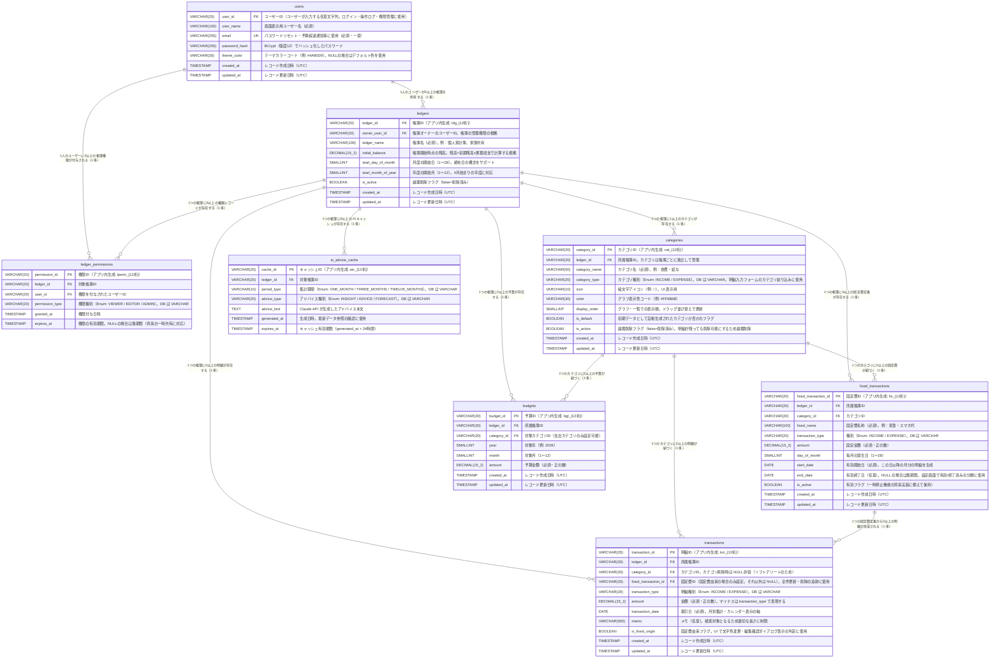

# Web版 家計簿管理アプリ「MoneyNote Web」
## AI駆動開発 プロジェクト企画書 v3.0

**作成日：** 2026年4月  
**対象：** 上司レビュー用・確定版  
**開発スタイル：** AIエージェント駆動開発（Claude Code）  
**リポジトリ構成：** モノレポ（frontend/ + backend/ を1リポジトリで管理）

---

## 目次

1. [プロジェクト概要](#1-プロジェクト概要)
2. [システム概要](#2-システム概要)
3. [機能定義](#3-機能定義)
4. [UI・画面設計](#4-ui画面設計)
5. [技術スタック](#5-技術スタック)
6. [DB設計](#6-db設計)
7. [AIエージェント開発の土台](#7-aiエージェント開発の土台)
8. [実装計画](#8-実装計画step分割)
9. [習得できる技術領域](#9-習得できる技術領域)
10. [TODO・将来エンハンス](#10-todo将来エンハンス)
11. [懸念点・リスクと対策](#11-懸念点リスクと対策)
12. [開始前チェックリストと初期セットアップ手順](#12-開始前チェックリストと初期セットアップ手順)

---

## 1. プロジェクト概要

### 1.1 背景・目的

スマホアプリ「シンプル家計簿 MoneyNote」（株式会社コモレビ）は、シンプルな操作性と充実した分析機能で多くのユーザーに支持されている。しかし同アプリはスマートフォン専用であり、PCブラウザから利用できるWeb版は存在しない。

本プロジェクトでは MoneyNote のコンセプト（シンプル・続けやすい・分析が充実）を踏襲しつつ、**Webブラウザから使える家計簿管理アプリ**を開発する。PCの大画面を最大限に活かした、画面遷移を減らした快適な操作性を重視する。

また本プロジェクトの主目的は、**Claude Code を用いたAI駆動開発の実践的習得**であり、要件定義・設計・実装・レビュー・運用保守・エンハンスの全工程を AI エージェントに担わせ、人間は意思決定と承認に徹するスタイルで進める。

### 1.2 開発スタイルの定義

```
【従来の開発】
人間がコードを書く → AI に質問する（補助的）

【本プロジェクトの開発スタイル】
AI エージェントがコードを書く → 人間が承認する（ディレクター）
```

| 役割 | 担当 |
|---|---|
| 要件定義・仕様策定 | 人間（最終承認）＋ AI エージェント（案の提示） |
| 設計・アーキテクチャ | AI エージェント（アーキテクトロール） |
| 実装・テストコード生成 | AI エージェント（エンジニアロール） |
| コードレビュー | AI エージェント（レビュアーロール） |
| セキュリティチェック | AI エージェント（SRE ロール） |
| リファクタリング | AI エージェント（リファクタロール） |
| エンハンス計画 | AI エージェント（PM ロール）＋ 人間（承認） |
| 動作確認・最終判断 | **人間のみ** |

### 1.3 人間の承認ゲート（3段階）

```
Gate 1｜設計承認
  /design コマンドで設計書を生成
  → 人間が内容を確認・「OK」と入力
  → 承認後に実装を指示する

Gate 2｜コード承認
  /implement または /frontend で実装・テストを生成
  → テストがグリーンか確認（AI が自動実行）
  → コードを読んで違和感がないか確認
  → OK なら自分で Git にコミットする

Gate 3｜動作確認
  docker compose up で起動
  → ブラウザで実際に操作して確認
  → seed.sh でリセットして再確認
  → OK なら次の Step へ進む
```

**コミット・プッシュは人間が行う。AI はファイル操作・テスト実行・コマンド実行を自律的に行ってよい。**

---

## 2. システム概要

### 2.1 システム名

**MoneyNote Web**（仮称）

### 2.2 ターゲットユーザー

- 家計管理を PC ブラウザで行いたい個人ユーザー
- 家族で家計を共有・管理したいユーザー

### 2.3 マルチアカウント・マルチ帳簿設計

#### 基本設計
- 1ユーザーが複数の帳簿を作成・管理できる
- 帳簿を切り替えることで全ての表示内容が切り替わる
- 全機能は「選択中の帳簿」を軸に動作する

#### 帳簿の設定項目
| 設定項目 | 説明 |
|---|---|
| 帳簿名 | 任意の名前（例：個人家計簿、家族共有帳簿） |
| 初期残高 | 帳簿開始時点の残高 |
| 月度の開始日 | 月の区切り日（1〜28日で設定可能） |
| 年度の開始月 | 年度の区切り月（1〜12月で設定可能） |
| カテゴリ設定 | 帳簿ごとにカテゴリをカスタマイズ（支出・収入に分類） |
| グラフ表示順 | カテゴリの表示順をドラッグで並び替え |

#### 残高の計算方式（両方実装）
```
繰り越し残高 = 前月末残高を自動引き継ぎ
累積残高     = 初期残高 ± 累積収支で常時計算
```

#### 将来 TODO：帳簿共有（権限管理）
現時点では DB 設計のみ拡張可能な構造で実装し、UI は将来のエンハンスで対応する。詳細は「10. TODO・将来エンハンス」を参照。

---

## 3. 機能定義

### 機能一覧

| # | 機能名 | 概要 |
|---|---|---|
| ① | 収入・支出の入力・一覧管理 | 明細の記録・カレンダー表示・一覧表示 |
| ② | 月別・年別の分析レポート | 収支・繰り越し・残高の推移分析 |
| ③ | カテゴリ別集計・グラフ | 円グラフ・棒グラフ・カテゴリ別明細 |
| ④ | 予算設定・予算オーバー警告 | カテゴリ別予算管理・アラート |
| ⑤ | CSVエクスポート・インポート | データの入出力 |
| ⑥ | AI による支出分析・アドバイス | 傾向分析・アドバイス生成 |
| ⑦ | ダッシュボード | 全機能のハブ・今月サマリー |
| ⑧ | 設定・管理（統合管理画面） | アカウント・帳簿・固定費・カテゴリ等の管理 |

---

### 機能① 収入・支出の入力・一覧管理

#### 何ができるか
- 収入・支出を日付・金額・カテゴリ・メモで記録する
- 表示月を前後に切り替えられる（月セレクター）
- **カレンダー表示**：日ごとの支出合計額・収入合計額を表示する
- カレンダーの日付をクリックして明細を入力できる
- **明細一覧**：日付グループごとに表示し、日次収支も表示する
- 明細一覧の最上部に月の収入合計・支出合計・収支を表示する
- **カテゴリは支出カテゴリと収入カテゴリに分類**され、種別（支出/収入）切り替えで選択肢が変わる
- **固定費由来の明細は文字色を変えて視覚的に区別**する（例：青色イタリック）
- 固定費明細の編集時は「1件のみ / 全件」の確認ダイアログを表示する
- 固定費の登録・管理は設定画面（機能⑧）で行う

#### 役割・必要性
家計簿の根幹機能。全ての分析の基となるデータを蓄積する。カレンダー＋一覧の2視点で直感的に家計を把握できる。

#### カテゴリ分類の仕様
```
支出カテゴリ（type: "EXPENSE"）
  例：食費・交通費・住居費・光熱費・通信費・医療費・娯楽費・衣服費・その他支出

収入カテゴリ（type: "INCOME"）
  例：給与・副収入・その他収入

明細入力フォームで「支出」を選択 → 支出カテゴリのみ表示
明細入力フォームで「収入」を選択 → 収入カテゴリのみ表示
```

---

### 機能② 月別・年別の分析レポート

#### 何ができるか
- 月ごとの収入・支出・収支・繰り越し・残高を数値表示する
- 年間の月別推移をグラフで表示する（棒グラフ）
- 前月・前年同月との比較を表示する
- 繰り越し残高：前月末残高を自動引き継ぎ
- 累積残高：初期残高±累積収支で常時計算

---

### 機能③ カテゴリ別集計・グラフ

#### 何ができるか
- 支出・収入をカテゴリ別に集計し円グラフで割合を表示する
- カテゴリ一覧から選択するとサブパネルでそのカテゴリの明細一覧と月別推移棒グラフを表示する
- 明細を選択するとサブパネルで編集フォームを表示する（画面遷移なし）

---

### 機能④ 予算設定・予算オーバー警告

#### 何ができるか
- カテゴリごとに月の予算上限を設定する（支出カテゴリのみ対象）
- 消化率をプログレスバーで表示する（🟢🟡🔴 信号機カラー）
- 80%超過で🟡警告、100%超過で🔴アラートを Toast で通知する

---

### 機能⑤ CSVエクスポート・インポート

#### 何ができるか
- 明細データを CSV 形式でエクスポートできる
- このアプリからエクスポートした CSV をそのままインポートできる
- 正しいフォーマットの CSV のみ受け付ける（AI 補正なし）
- カテゴリはコード値（カテゴリ ID）で管理し、拡張性を確保する

#### CSVフォーマット仕様（DB設計確定後に最終確認）
```
ヘッダー行:
  transaction_id, ledger_id, transaction_date, transaction_type,
  amount, category_id, category_type, memo, is_fixed_origin,
  fixed_transaction_id, created_at

transaction_type: INCOME または EXPENSE（Enum コード値）
category_type: INCOME または EXPENSE（Enum コード値）
category_id: カテゴリの ID 文字列（例: cat_food_001）
is_fixed_origin: true または false
fixed_transaction_id: 固定費 ID または空文字

※ category_id が帳簿に存在しない場合はインポートエラーとする
※ 将来的に category_name 列を追加する拡張も可能な設計とする
```

---

### 機能⑥ AI による支出分析・アドバイス

#### 何ができるか
- 直近1ヶ月・3ヶ月・12ヶ月の収支傾向を自動集計し常時表示する（API コストなし）
- 予算と実績の比較分析を常時表示する
- 比較対象：前月・前年同月
- **ユーザーのボタン操作をトリガー**として以下を Claude API で実行する：
  - 自然言語によるインサイト生成
  - 節約改善アドバイス生成
  - 来月の支出予測
- インサイト・アドバイスは常に最新データを参照して生成する
- 生成結果は ai_advice_cache に24時間キャッシュする

#### 常時表示 vs ボタントリガーの分離
```
【常時表示（API コストなし）】
・直近 1/3/12ヶ月の収支推移グラフ
・予算 vs 実績の比較表
・前月比・前年比の数値

【ボタントリガー（Claude API 呼び出し）】
・「今月を分析する」→ 自然言語インサイト生成
・「改善提案を見る」→ 節約アドバイス生成
・「来月を予測する」→ 来月支出予測
```

---

### 機能⑦ ダッシュボード

#### 何ができるか
- ログイン後の最初の画面として全情報の概要を表示する
- 表示月を変更できる（月セレクター）
- ヘッダーから帳簿の切り替えを行える
- 今月の収入・支出・収支・残高サマリーを表示する
- カテゴリ別円グラフ（今月）を表示する
- 予算消化率を信号機で一覧表示する
- AI アドバイスのサマリーを表示する
- 最近の明細を表示する（デフォルト10件・変更可能）

---

### 機能⑧ 設定・管理（統合管理画面）

設定画面を1つに統合し、タブ切り替えで各種管理機能にアクセスする。

| タブ | 機能内容 |
|---|---|
| アカウント | ユーザー名・メールアドレス・パスワード変更・テーマカラー設定 |
| 帳簿管理 | 帳簿の追加・編集・削除 |
| 帳簿設定 | 選択中帳簿の詳細設定（カテゴリ・開始日・グラフ順等） |
| 固定費管理 | 固定費・定期収入の登録・編集・削除（有効/終了済みで分類） |
| レポート | 選択中帳簿の年間レポート（棒・円・折れ線グラフ） |
| 検索 | 取引の横断検索（キーワード・カテゴリ・期間） |
| データ管理 | CSV エクスポート・インポート |

#### 固定費管理タブの仕様
```
【有効な固定費】（終了日が未来または未設定のもの）
🔁 家賃         住居費  毎月1日  ¥80,000  2024/01〜    [編集][削除]
🔁 スマホ代     通信費  毎月25日 ¥5,500   2024/04〜    [編集][削除]

【終了済みの固定費】（終了日が過去のもの）
🔁 旧サブスク   娯楽費  毎月15日 ¥1,490   2024/01〜2025/03  [詳細]
```

---

## 4. UI・画面設計

### 4.1 デザインコンセプト

- **PCファースト・大画面活用**：サイドメニュー＋メインコンテンツ＋サブパネルの3ペイン構成でページ遷移を最小化
- **シンプル・直感的**：操作方法に迷わない明快な UI
- **信号機モデル**：数値を読まなくても色で状態がわかる（🟢🟡🔴）
- **コンポーネント再利用**：明細入力フォーム・明細一覧・グラフ等を複数画面で共用

### 4.2 レイアウト方針と画面遷移の設計根拠

#### 3ペイン構成の採用理由
スマホアプリは1画面1機能が基本だが、PCブラウザでは画面幅が十分にある。そのため、以下の3ペイン構成を採用し画面遷移を最小化する。

```
┌──────────────────────────────────────────────────────────────┐
│ ヘッダー（全画面共通）                                        │
├─────────────┬────────────────────────┬────────────────────────┤
│サイドメニュー│   メインコンテンツ      │   サブパネル           │
│（固定）     │   （選択中のページ）     │  （詳細・編集・入力）  │
│             │                        │  ・明細入力フォーム    │
│             │                        │  ・明細編集フォーム    │
│             │                        │  ・カテゴリ別明細      │
│             │                        │  ・AI 分析結果        │
└─────────────┴────────────────────────┴────────────────────────┘
```

- **サイドメニュー**：常時固定表示。ページ遷移はここで行う
- **メインコンテンツ**：選択中ページの一覧・グラフ等を表示
- **サブパネル**：メインコンテンツの操作に応じて右側に表示。独立したページ遷移は発生しない

#### サブパネルを使う操作（URL は変わらない）
| 操作 | サブパネルの内容 |
|---|---|
| ＋追加ボタン押下 | 明細入力フォーム |
| 明細の編集ボタン押下 | 明細編集フォーム |
| カレンダーの日付クリック | その日付がセットされた明細入力フォーム |
| カテゴリ一覧でカテゴリ選択 | カテゴリ別明細一覧＋棒グラフ |
| AI「分析する」ボタン押下 | AI 生成結果 |

#### 独立したページ遷移を行う操作（URL が変わる）
| 画面 | 理由 |
|---|---|
| ログイン・登録・パスワードリセット | 未認証ページのため別 URL が必須 |
| ダッシュボード → 各機能ページ | ブックマーク・ブラウザバックを可能にするため |
| 設定ページ | 複数タブの設定を管理するため |

### 4.3 画面一覧とパス設計

| 画面名 | パス | レイアウト | 備考 |
|---|---|---|---|
| ランディング | `/` | 認証なし | 未ログイン時のトップ |
| ログイン | `/login` | 認証なし | ユーザーID＋パスワード |
| 会員登録 | `/register` | 認証なし | ユーザーID・名前・メール・PW |
| パスワードリセット申請 | `/password-reset` | 認証なし | メールアドレス入力 |
| パスワード再設定 | `/password-reset/confirm` | 認証なし | トークン付き URL |
| ダッシュボード | `/dashboard` | 3ペイン | ログイン後の初期画面 |
| 明細・カレンダー | `/ledgers/[ledgerId]/transactions` | 3ペイン | サブパネルで入力・編集 |
| 分析レポート | `/ledgers/[ledgerId]/reports` | 3ペイン | タブ：月別/年別 |
| カテゴリ別集計 | `/ledgers/[ledgerId]/categories` | 3ペイン | サブパネルでドリルダウン |
| 予算設定 | `/ledgers/[ledgerId]/budget` | 3ペイン | カテゴリ別予算管理 |
| AI 分析 | `/ledgers/[ledgerId]/ai` | 3ペイン | サブパネルで AI 結果表示 |
| 設定 | `/settings` | 2ペイン | クエリ？tab=で切替 |

**パス設計の根拠：**
- `/ledgers/[ledgerId]/` プレフィックス：帳簿スコープを URL に含めることで、ブックマーク・共有時に正確な帳簿が特定できる
- 設定画面は帳簿に依存しないため `/settings` に分離
- 認証不要ページは `/login` 等のトップレベルパスに配置

### 4.4 認証・不正アクセス防止の設計

#### フロントエンド側の防御
```
1. Next.js middleware.ts
   - 全リクエストをインターセプト
   - Cookie に有効なアクセストークンがない場合は /login にリダイレクト
   - /login・/register・/password-reset は認証不要としてスキップ

2. JWT の保存方法
   - アクセストークン: メモリ（Zustand store）に保持
     → XSS 攻撃でも LocalStorage より安全
   - リフレッシュトークン: HttpOnly Cookie に保存
     → JavaScript からアクセス不可。CSRF 対策として SameSite=Strict を設定
```

#### バックエンド側の防御
```
3. Spring Security Filter
   - 全 API リクエストで Authorization ヘッダーの JWT を検証
   - 無効・期限切れトークンは 401 Unauthorized を返す

4. 帳簿アクセス制御（認可）
   - /api/v1/ledgers/{ledgerId}/* の全エンドポイントで
     ログインユーザーが対象帳簿の権限を持つか DB で確認
   - 権限なしは 403 Forbidden を返す
   - URL を知っていても他人の帳簿データにはアクセス不可

5. レート制限
   - ログイン API: 同一 IP から5回失敗で15分ロック（Redis で管理）
   - パスワードリセット API: 同一メールへ1時間に3回まで

6. CORS 設定
   - フロントエンドのオリジン（localhost:3000）のみ許可
```

### 4.5 グローバルレイアウト詳細

```
┌─────────────────────────────────────────────────────────────────────┐
│ ヘッダー（高さ: 56px 固定）                                          │
│ [🏦 MoneyNote Web]  [帳簿: 個人家計簿 ▼]  [＜ 2026年4月 ＞]  [田中 👤]│
├──────────────┬──────────────────────────────┬───────────────────────┤
│ サイドメニュー│ メインコンテンツ              │ サブパネル             │
│ （幅: 200px）│ （残り幅を均等分割）           │ （幅: 400px）          │
│ 固定         │                              │ 閉じるボタン [×] あり  │
│              │                              │ 操作に応じて表示       │
│ 🏠 ダッシュ  │                              │                       │
│ 💰 明細      │                              │                       │
│ 📊 レポート  │                              │                       │
│ 🥧 カテゴリ  │                              │                       │
│ 🎯 予算      │                              │                       │
│ 🤖 AI分析    │                              │                       │
│ ────────     │                              │                       │
│ ⚙️ 設定      │                              │                       │
└──────────────┴──────────────────────────────┴───────────────────────┘
```

**スマホ時（幅 768px 未満）：**
- サイドメニュー → ボトムナビゲーションに変換
- サブパネル → 全画面モーダルに変換
- メインコンテンツ → 全幅表示

### 4.6 主要画面のレイアウト詳細

#### ダッシュボード（`/dashboard`）

```
ヘッダー: [MoneyNote Web] [個人家計簿▼] [＜ 2026年4月 ＞] [田中👤]
─────────────────────────────────────────────────────────────────────
サイドメニュー │  ┌────────┐ ┌────────┐ ┌────────┐ ┌────────┐
               │  │ 収入   │ │ 支出   │ │ 収支   │ │ 残高   │
               │  │¥280,000│ │¥235,000│ │+¥45,000│ │¥1.2M  │
               │  └────────┘ └────────┘ └────────┘ └────────┘
               │
               │  ┌──────────────────┐  ┌───────────────────┐
               │  │ カテゴリ別支出    │  │ 予算消化率         │
               │  │ （円グラフ）      │  │ 食費    🟡 87%   │
               │  │   🥧             │  │ 交通費  🟢 53%   │
               │  │                  │  │ 娯楽費  🔴 115%  │
               │  └──────────────────┘  └───────────────────┘
               │
               │  ┌──────────────────────────────────────────┐
               │  │ 🤖 AI サマリー          [今月を分析する] │
               │  │ （前回の分析結果または未分析の旨を表示）  │
               │  └──────────────────────────────────────────┘
               │
               │  ┌──────────────────────────────────────────┐
               │  │ 最近の明細（10件）       表示件数[10▼]   │
               │  │ 4/15 🍔食費  ランチ        -¥1,200      │
               │  │ 4/14 🚃交通費 定期外        -¥540       │
               │  │ ...                      [すべて見る →]  │
               │  └──────────────────────────────────────────┘
```

#### 明細・カレンダー（`/ledgers/[ledgerId]/transactions`）

```
ヘッダー: [MoneyNote Web] [個人家計簿▼] [＜ 2026年4月 ＞] [田中👤]
─────────────────────────────────────────────────────────────────────
サイドメニュー │  収入: ¥280,000  支出: ¥235,000  収支: +¥45,000
               │
               │  【カレンダー】
               │  月  火  水  木  金  土  日
               │   -   -   -  支¥1,200  -  -   -
               │  支¥540  -   -  ...
               │  （支出日: 赤文字、収入日: 青文字）
               │
               │  【明細一覧】                          [＋ 追加]
               │  ─────────────────────────────────────────
               │  2026/04/15（火）  日次収支 -¥1,200
               │  🍔 食費  ランチ             -¥1,200  [編]
               │  ─────────────────────────────────────────
               │  2026/04/14（月）  日次収支 -¥540
               │  🚃 交通費  定期外（固定費）   -¥540  [編]
               │    ↑ 固定費明細は青色イタリックで表示
               │  ─────────────────────────────────────────
               │  2026/04/10（木）  日次収支 +¥280,000
               │  💰 給与  4月分給与（固定費）+¥280,000  [編]

                                     │  【サブパネル（追加/編集時）】
                                     │  ┌────────────────────────┐
                                     │  │ 明細を追加      [×]    │
                                     │  ├────────────────────────┤
                                     │  │ 種別 [支出●] [収入○]  │
                                     │  │ 日付 2026/04/15        │
                                     │  │ 金額 ¥[__________]    │
                                     │  │ カテゴリ [食費      ▼]│
                                     │  │  ↑ 支出カテゴリのみ表示│
                                     │  │ メモ [______________]  │
                                     │  │                        │
                                     │  │ [キャンセル]  [保存]  │
                                     │  └────────────────────────┘
```

---

## 5. 技術スタック

### 5.1 採用スタック一覧

| カテゴリ | 技術 | バージョン | 習得できる領域 |
|---|---|---|---|
| フロントエンド | Next.js + TypeScript | 14 / 5.x | SSR・App Router |
| スタイル | Tailwind CSS | 3.x | UI・レスポンシブ |
| グラフ | Recharts | 2.x | 円・棒・折れ線グラフ |
| 状態管理 | Zustand | 4.x | クライアント状態管理 |
| フォーム | React Hook Form + Zod | — | バリデーション・型安全 |
| バックエンド | Spring Boot + Java | 3.x / 21 | バックエンド・DI・AOP |
| REST API | Spring MVC + Springdoc | — | API 設計・OpenAPI |
| 認証 | Spring Security + JWT | 6.x | セキュリティ・認証・認可 |
| AI 連携 | Spring AI + Claude API | 1.x | LLM 連携・エージェント |
| ORM | Spring Data JPA + Hibernate | — | DB 操作・N+1 対策 |
| DB | PostgreSQL | 16 | DB 設計・正規化 |
| DB マイグレーション | Flyway | 9.x | スキーマバージョン管理 |
| キャッシュ | Redis | 7.x | セッション・キャッシュ・レート制限 |
| CSV 処理 | Apache Commons CSV | 1.x | CSV 入出力 |
| テスト（BE） | JUnit5 + Testcontainers + MockMvc | — | 単体・結合テスト |
| テスト（FE） | Jest + React Testing Library | — | コンポーネントテスト |
| メール（開発） | Mailhog | — | メール確認（完全無料） |
| インフラ | Docker Compose | — | コンテナ・ネットワーク |
| CI | GitHub Actions | — | CI/CD パイプライン |
| コード品質 | Checkstyle + ESLint + Prettier | — | コード規約・品質 |

### 5.2 モノレポ構成

```
moneynote-web/                    ← GitHub リポジトリルート
├── CLAUDE.md                     ← エージェントへの憲法（最重要）
├── AGENTS.md                     ← 役割別エージェント定義
├── TODO.md                       ← 将来エンハンス・TODO 管理
├── .claude/
│   ├── commands/                 ← カスタムコマンド（8種）
│   │   ├── design.md
│   │   ├── implement.md
│   │   ├── frontend.md
│   │   ├── review.md
│   │   ├── security.md
│   │   ├── test.md
│   │   ├── refactor.md
│   │   └── ops.md
│   └── settings.json
├── docker-compose.yml
├── seed.sh
├── .env.example
├── .gitignore
├── docs/
│   ├── architecture.md
│   ├── screen-design.md
│   ├── api-spec.md
│   └── decisions/
│       ├── 001-monorepo.md
│       ├── 002-db-design.md
│       └── 003-layout-3pane.md
├── backend/
│   ├── build.gradle
│   ├── src/main/java/com/example/moneynote/
│   │   ├── MoneynoteApplication.java
│   │   ├── config/
│   │   ├── domain/
│   │   │   ├── user/
│   │   │   ├── ledger/
│   │   │   ├── transaction/
│   │   │   ├── category/
│   │   │   ├── budget/
│   │   │   ├── fixed/
│   │   │   └── ai/
│   │   ├── api/
│   │   ├── common/
│   │   └── infrastructure/
│   └── src/test/
└── frontend/
    ├── package.json
    └── src/
        ├── app/
        │   ├── (auth)/           ← 認証不要ページ群
        │   │   ├── login/
        │   │   ├── register/
        │   │   └── password-reset/
        │   ├── (app)/            ← 認証必要ページ群（3ペインレイアウト）
        │   │   ├── layout.tsx    ← 3ペインレイアウト共通
        │   │   ├── dashboard/
        │   │   ├── ledgers/
        │   │   │   └── [ledgerId]/
        │   │   │       ├── transactions/
        │   │   │       ├── reports/
        │   │   │       ├── categories/
        │   │   │       ├── budget/
        │   │   │       └── ai/
        │   │   └── settings/
        │   └── layout.tsx
        ├── components/
        │   ├── ui/               ← 汎用 UI パーツ
        │   ├── layout/           ← Header・SideMenu・SubPanel
        │   ├── transaction/      ← 明細関連
        │   ├── charts/           ← グラフ
        │   └── budget/           ← 予算関連
        ├── hooks/
        ├── stores/               ← Zustand ストア
        ├── lib/
        │   └── api/              ← API クライアント
        └── types/
```

---

## 6. DB設計

### 6.1 設計方針

| 方針 | 内容 |
|---|---|
| ID 形式 | 全テーブルの PK は文字列型。アプリ側で `usr_`・`ldg_`・`cat_` 等のプレフィックス付き一意文字列を生成して採番する |
| タイプ・区分 | Java 側は Enum 型、DB 側は VARCHAR 型で格納する |
| 論理削除 | 基本的に物理削除。固定費明細は fixed_transaction_id で追跡するため参照整合性が重要 |
| 残高計算 | DB に残高カラムを持たず「初期残高 ± 累積収支」をアプリ側で都度計算する |
| 多重度根拠 | 各エンティティの関係性は設計根拠と共に明記する |

### 6.2 ID 生成規則

```
ユーザー:     usr_{12桁のランダム英数字}  例: usr_a1b2c3d4e5f6
帳簿:         ldg_{12桁}                  例: ldg_g7h8i9j0k1l2
帳簿権限:     lperm_{12桁}
カテゴリ:     cat_{12桁}                  例: cat_m3n4o5p6q7r8
明細:         txn_{12桁}                  例: txn_s9t0u1v2w3x4
固定費:       fix_{12桁}                  例: fix_y5z6a7b8c9d0
予算:         bgt_{12桁}                  例: bgt_e1f2g3h4i5j6
AI キャッシュ: aic_{12桁}
```

### 6.3 ER図（Mermaid）



### 6.4 多重度の根拠まとめ

| リレーション | 多重度 | 根拠 |
|---|---|---|
| users → ledgers | 1:多 | 1ユーザーが複数帳簿を持てる。帳簿なしのユーザーも存在する（登録直後）|
| users → ledger_permissions | 1:多 | 将来の帳簿共有で複数帳簿への権限を持つ可能性がある |
| ledgers → categories | 1:多（1以上） | カテゴリは帳簿ごとに独立。帳簿作成時にデフォルトカテゴリを自動生成するため最低1件 |
| ledgers → transactions | 1:多（0以上） | 帳簿作成直後は明細なし |
| fixed_transactions → transactions | 1:多（0以上） | 固定費登録直後・有効期間前は明細未生成 |
| categories → transactions | 1:多（0以上） | カテゴリを作成しただけでは明細はない。カテゴリ論理削除後も明細は残存 |

---

## 7. AIエージェント開発の土台

### 7.1 CLAUDE.md（確定全文）

```markdown
# CLAUDE.md - エージェントへの憲法

## このファイルの目的
Claude Code がこのプロジェクトで自律的に開発を進めるための
ルール・方針・文脈を定義する。
全ての作業の前にこのファイルを読み、方針に従って行動すること。

---

## プロジェクト概要
MoneyNote Web - Web 版家計簿管理アプリ（モノレポ構成）
マルチアカウント・マルチ帳簿対応。PC 大画面を活かした 3 ペインレイアウト。

## リポジトリ構成（モノレポ）
- backend/   ← Spring Boot 3.x / Java 21
- frontend/  ← Next.js 14 / TypeScript

---

## 技術スタック

### Backend
- Spring Boot 3.x / Java 21
- Spring Security + JWT
  - アクセストークン: 15分
  - リフレッシュトークン: 7日（Redis で管理）
- Spring AI + Claude API（モック切替対応）
- Spring Data JPA + Hibernate + PostgreSQL 16
- Flyway（DB マイグレーション）
- Redis 7（セッション・キャッシュ・レート制限）
- Apache Commons CSV
- JUnit5 + Testcontainers + MockMvc

### Frontend
- Next.js 14 / TypeScript / Tailwind CSS
- Zustand（状態管理）
- React Hook Form + Zod（フォーム・バリデーション）
- Recharts（グラフ）
- Jest + React Testing Library

---

## ID 生成規則
全テーブルの PK は文字列型。アプリ側で以下のプレフィックス付き一意文字列を生成する。
- ユーザー:     usr_{12桁ランダム英数字}
- 帳簿:         ldg_{12桁}
- 帳簿権限:     lperm_{12桁}
- カテゴリ:     cat_{12桁}
- 明細:         txn_{12桁}
- 固定費:       fix_{12桁}
- 予算:         bgt_{12桁}
- AI キャッシュ: aic_{12桁}
ただしユーザー ID のみ、ユーザーが任意に入力する（例: tanaka_01）。

---

## アーキテクチャ原則
1. レイヤードアーキテクチャを厳守: Controller → Service → Repository
2. ドメインロジックは Service に集約（Controller・Repository に書かない）
3. 全 API は /api/v1/ プレフィックスを付ける
4. 全 /api/v1/ledgers/{ledgerId}/* エンドポイントで帳簿アクセス制御を実装する
5. AI 呼び出しはモック切替可能にする（application-dev.yml の ai.mock=true）

---

## セキュリティ必須ルール
- パスワード: BCrypt 強度12でハッシュ化
- JWT: アクセストークン15分 / リフレッシュトークン7日
  - アクセストークンはレスポンスボディで返す
  - リフレッシュトークンは HttpOnly・SameSite=Strict の Cookie で返す
- 帳簿アクセス: ログインユーザーが帳簿の権限を持つか必ず DB で検証。権限なしは 403 を返す
- ログイン失敗: 同一 IP から5回失敗で15分ロック（Redis で管理）
- SQLインジェクション: JPQL または CriteriaAPI を使用（ネイティブ SQL 禁止）
- 機密情報（パスワード・トークン）をログに出力しない
- セキュリティ変更時は理由をコメントに記載する

---

## コーディング規約

### Java
- クラス名: UpperCamelCase
- メソッド名・変数名: lowerCamelCase
- 定数: UPPER_SNAKE_CASE
- パッケージ: com.example.moneynote.{layer}.{domain}
- 例外: カスタム例外クラスを使う（RuntimeException 直接使用禁止）
  - ResourceNotFoundException（404）
  - AccessDeniedException（403）
  - ValidationException（400）
  - ExternalApiException（502）
- レスポンス形式: { "data": {...}, "error": null, "timestamp": "..." }
- エラー形式: { "data": null, "error": { "code": "E001", "message": "..." }, "timestamp": "..." }
- タイプ・区分は Java 側 Enum / DB 側 VARCHAR で管理する

### TypeScript
- any 型の使用禁止
- コンポーネント: アロー関数で定義
- ESLint + Prettier の設定に従う
- API クライアント: lib/api/ に集約

---

## テスト必須ルール
- 全 Service クラスに JUnit5 テストを作成する
- DB を使うテストは Testcontainers を使用する
- MockMvc で全 API エンドポイントのテストを作成する
- テストには帳簿アクセス制御（他ユーザーが 403 になること）を含める
- テストカバレッジ目標: 80% 以上
- テストなしの実装は行わない

---

## エージェントの自律的な行動ルール

### 自律的に実行してよい操作（確認不要）
- ファイルの読み書き・作成・削除
- ./gradlew build / ./gradlew test の実行
- npm run build / npm test / npm run lint の実行
- docker compose up -d / docker compose down の実行
- seed.sh の実行

### 実装前に必ず行うこと
1. このファイル（CLAUDE.md）を読む
2. 実装対象の設計書（docs/ 配下）を読む
3. 設計書がない場合は /design コマンドで設計書を先に出力し承認を待つ

### 実装時のルール
- 機能や画面の区分ごと・意味的・目的が類似したファイルはまとめて変更する
- 実装とテストは必ずセットで作成する
- 不明点があれば実装を止めて質問リストを出力する
- エラー発生時: 原因・影響範囲・修正方針を先に説明してから修正する

### やってはいけないこと
- コミット・プッシュ（人間が行う）
- 設計書がない状態での実装開始
- テストなしの実装
- any 型の使用（TypeScript）

---

## ローカル環境の起動方法
```bash
docker compose up -d          # 全サービス起動
./seed.sh                     # テストデータ投入・リセット
# フロント:  http://localhost:3000
# API/Swagger: http://localhost:8080/swagger-ui.html
# メール:    http://localhost:8025
```

---

## よくある行き詰まりと対処法

### Testcontainers でテストが失敗する場合
→ Docker Desktop が起動しているか確認。WSL2 統合が有効か確認。

### Spring AI / Claude API でエラーが出る場合
→ application-dev.yml の ai.mock=true に変更してモックで代替する。

### Flyway マイグレーションが失敗する場合
→ docker compose down -v でボリュームを削除してから docker compose up -d で再起動する。

### フロントエンドで API 接続エラーが出る場合
→ CORS 設定を確認。バックエンドが :8080 で起動しているか確認。
```

### 7.2 AGENTS.md（確定全文）

```markdown
# AGENTS.md - 役割別エージェント定義

## 使い方
Claude Code への指示の冒頭で /コマンド名 を入力する。

---

## ロール定義

### /design [設計対象]
**ロール: アーキテクト**
責務: 技術選定・設計書・ER 図・シーケンス図・API 仕様の作成
制約:
  - コードを書かない。設計書のみを出力する
  - 承認（ユーザーの「OK」入力）前に実装を始めない
  - 設計判断の根拠を必ず記載する
出力: Markdown 設計書・Mermaid 図・docs/decisions/ への ADR

### /implement [設計書パス]
**ロール: バックエンドエンジニア**
責務: Spring Boot 実装・API 実装・テスト
制約:
  - 指定された設計書を読んでから実装する
  - テストコードを同時に作成する（テストなし実装禁止）
  - 帳簿アクセス制御を全 API に実装する
  - ./gradlew test を自律的に実行してグリーンを確認する
出力: Java コード・JUnit5 テスト・Flyway マイグレーション

### /frontend [仕様または設計書パス]
**ロール: フロントエンドエンジニア**
責務: Next.js コンポーネント・画面・API クライアント実装
制約:
  - any 型禁止
  - 共通コンポーネント（TransactionEditForm 等）を積極的に再利用する
  - サブパネルで表示するコンポーネントはメインコンテンツと独立して動作させる
  - npm test を自律的に実行してグリーンを確認する
出力: TypeScript コード・コンポーネントテスト

### /review
**ロール: シニアレビュアー**
責務: コードレビュー・品質チェック
制約: 実装はしない。指摘事項のみを出力する
出力: Critical / Major / Minor の優先度付き指摘リスト

### /security
**ロール: SRE**
責務: セキュリティ診断・OWASP Top 10 確認
制約: 診断のみ実施。修正は /implement または /refactor で行う
出力: セキュリティ診断レポート

### /test [対象クラスまたはパス]
**ロール: QA エンジニア**
責務: テスト追加・カバレッジ向上
制約: 機能コードは変更しない
出力: テストコード

### /refactor
**ロール: リファクタエンジニア**
責務: コード品質改善・技術的負債解消
制約: 機能を変えない。テストがグリーンのまま完了させる
出力: リファクタ済みコード・変更点サマリー

### /ops [内容]
**ロール: 運用エンジニア**
責務: エラー分析・ドキュメント生成・CI/CD 構築
出力: 原因分析レポート・ドキュメント・設定ファイル
```

### 7.3 Claude Code カスタムコマンド設定（`.claude/settings.json`）

```json
{
  "rules": [
    "実装前に必ず CLAUDE.md と対象機能の設計書を読むこと",
    "設計書がない場合は /design で設計書を出力してからユーザーの承認（'OK'入力）を待つこと",
    "テストコードなしの実装コードは生成しない",
    "帳簿へのアクセス制御（ログインユーザーの権限確認）を必ず全 API に実装する",
    "セキュリティに関わる変更は理由をコメントに記載する",
    "日本語でコメント・ドキュメントを記述する",
    "エラー発生時は原因・影響範囲・修正方針を説明してから修正する",
    "ファイル操作・テスト実行・docker コマンドは自律的に実行してよい",
    "コミット・プッシュはユーザーが行うため実行しない"
  ],
  "permissions": {
    "allow": ["Bash", "Read", "Write"],
    "deny": []
  }
}
```

---

## 8. 実装計画（Step分割）

### 基本方針
- **「動く状態を最優先」**：各 Step の終わりには必ずブラウザで動作確認する
- **「私が何をするか」を軸**に記述する
- AI がテスト・ビルド・ファイル操作を自律実行する。コミット・プッシュのみ私が行う

---

### 【事前準備】初期セットアップ（開発開始前）

> ここは私が全て手動で行う。Claude Code はまだ使わない。

#### 準備 Step 1｜開発ツールのインストールと確認

**私がやること：**
```bash
# 1. 以下をインストールして確認コマンドを実行する
docker --version        # 20.x 以上であること
docker compose version  # 2.x 以上であること
node --version          # v20.x 以上であること
java --version          # 21.x 以上であること
git --version           # バージョン確認

# 2. WSL2 の確認（Windows 必須）
wsl --status
# → "既定のバージョン: 2" が表示されていること

# 3. Docker Desktop の設定確認
# Docker Desktop → Settings → Resources → WSL Integration
# → 使用する WSL ディストリビューションが有効になっていること
```

インストールするもの：
- Docker Desktop（WSL2 統合を有効化）
- Node.js 20 LTS（https://nodejs.org/）
- Java 21 Eclipse Temurin（https://adoptium.net/）
- VS Code + Claude Code 拡張（Marketplace で「Claude Code」を検索）
- Git（https://git-scm.com/）

#### 準備 Step 2｜GitHub リポジトリの作成

**私がやること：**
```bash
# 1. GitHub でリポジトリを作成する
#    リポジトリ名: moneynote-web
#    可視性: Private（社内プロジェクトのため）
#    README, .gitignore は後で追加するのでチェックしない

# 2. ローカルにクローンする
git clone https://github.com/[自分のユーザー名]/moneynote-web.git
cd moneynote-web
```

#### 準備 Step 3｜Claude API キーの取得と設定

**私がやること：**
```bash
# 1. https://console.anthropic.com にアクセスしてアカウント作成
# 2. API Keys → Create Key でキーを発行
# 3. プロジェクトルートに .env ファイルを作成して以下を記述
#    （このファイルは .gitignore に追加して絶対にコミットしない）

# .env の内容:
CLAUDE_API_KEY=sk-ant-xxxxxxxxxxxx
DB_URL=jdbc:postgresql://localhost:5432/moneynote
DB_USERNAME=moneynote
DB_PASSWORD=moneynote
REDIS_HOST=localhost
REDIS_PORT=6379
JWT_SECRET=（32文字以上のランダム文字列を設定する）
```

#### 準備 Step 4｜Claude Code の起動と CLAUDE.md の配置

**私がやること：**
```bash
# 1. VS Code でプロジェクトを開く
code .

# 2. VS Code のターミナルで Claude Code を起動する
# VS Code 上部メニュー → Claude → Start Session
# または Ctrl+Shift+P → "Claude: Start" を選択

# 3. プロジェクトルートに CLAUDE.md を手動で作成する
# （企画書の第7章 7.1 の内容をそのままコピーして貼り付ける）
# ファイルパス: moneynote-web/CLAUDE.md

# 4. .claude/ ディレクトリを作成する
mkdir -p .claude/commands

# 5. .claude/settings.json を作成する
# （企画書の第7章 7.3 の内容をそのままコピーして貼り付ける）
```

---

### 【Step 1】プロジェクト雛形の生成

> 最初の Claude Code への指示。ここから AI 駆動開発が始まる。

#### Step 1-1｜雛形生成の指示

**私がやること：Claude Code に以下をコピペして入力する**

```
CLAUDE.md を読んでください。
読み終わったら、以下の仕様でプロジェクト全体の雛形を作成してください。

【作成するファイル一覧】

1. docker-compose.yml
   サービス構成:
   - db: postgres:16-alpine
     環境変数: POSTGRES_DB=moneynote, POSTGRES_USER=moneynote, POSTGRES_PASSWORD=moneynote
     ポート: 5432:5432
     ボリューム: postgres_data:/var/lib/postgresql/data
   - redis: redis:7-alpine
     ポート: 6379:6379
   - mailhog: mailhog/mailhog
     ポート: 8025:8025（Web UI）, 1025:1025（SMTP）
   - backend: ./backend をビルド
     ポート: 8080:8080
     depends_on: db, redis
     environment: .env ファイルから読み込む
   - frontend: ./frontend をビルド
     ポート: 3000:3000
     depends_on: backend

2. backend/build.gradle
   plugins: java, org.springframework.boot 3.3.x, io.spring.dependency-management
   dependencies（以下を全て含める）:
   - spring-boot-starter-web
   - spring-boot-starter-security
   - spring-boot-starter-data-jpa
   - spring-boot-starter-data-redis
   - spring-boot-starter-mail
   - spring-ai-anthropic-spring-boot-starter（バージョン 1.0.0-M6）
   - springdoc-openapi-starter-webmvc-ui（バージョン 2.5.0）
   - flyway-core + flyway-database-postgresql
   - postgresql（runtime）
   - commons-csv（バージョン 1.11.0）
   - jjwt-api + jjwt-impl + jjwt-jackson（バージョン 0.12.6）
   - lombok
   - spring-boot-starter-test
   - spring-boot-testcontainers
   - testcontainers（postgresql）

3. backend/src/main/resources/application.yml
   spring.datasource: ${DB_URL}, ${DB_USERNAME}, ${DB_PASSWORD}
   spring.jpa.hibernate.ddl-auto: validate
   spring.flyway.enabled: true
   spring.data.redis.host: ${REDIS_HOST}, port: ${REDIS_PORT}
   spring.mail.host: localhost, port: 1025
   spring.ai.anthropic.api-key: ${CLAUDE_API_KEY}
   springdoc.swagger-ui.path: /swagger-ui.html

4. backend/src/main/resources/application-dev.yml
   ai.mock: true（開発時は Claude API を呼ばずにダミーテキストを返す）

5. backend/src/main/java/com/example/moneynote/MoneynoteApplication.java
   Spring Boot 起動クラス

6. frontend/package.json
   dependencies:
   - next@14, react@18, react-dom@18
   - typescript, @types/node, @types/react, @types/react-dom
   - tailwindcss, postcss, autoprefixer
   - zustand@4
   - react-hook-form, @hookform/resolvers, zod
   - recharts
   devDependencies:
   - jest, @testing-library/react, @testing-library/jest-dom

7. frontend/next.config.js
   API のプロキシ設定: /api → http://backend:8080

8. frontend/src/app/layout.tsx
   HTML の基本構造

9. AGENTS.md（企画書の第7章 7.2 の内容）

10. TODO.md（空ファイル、第10章の内容を後で追記）

11. seed.sh
    内容:
    #!/bin/bash
    echo "Seeding database..."
    # テスト用ユーザー（user_id: test_user_001, password: password123）
    # 帳簿: 個人家計簿
    # 各種ダミーデータを後の Step で追記していく雛形

12. .env.example（実際の値は入れない）
13. .gitignore（.env, build/, .next/, node_modules/ 等を含む）

【完了条件】
docker compose up -d を実行して以下が全て起動すること:
- http://localhost:3000 で Next.js の初期画面が表示される
- http://localhost:8080/swagger-ui.html で Swagger UI が表示される
- http://localhost:8025 で Mailhog の画面が表示される
```

**私が動作確認すること（Gate 3）：**
```
□ docker compose up -d を実行してエラーが出ないこと
□ http://localhost:3000 が表示されること
□ http://localhost:8080/swagger-ui.html が表示されること
□ http://localhost:8025 が表示されること
□ .env が .gitignore に含まれていること（git status で確認）
□ 確認できたら git add . して git commit する
```

---

### 【Step 2】DB設計・マイグレーション

> DB の土台を作る。後の全実装の基盤になる。

#### Step 2-1｜DB 設計の確認と実装指示

**私がやること：Claude Code に以下をコピペして入力する**

```
CLAUDE.md を読んでください。
次に企画書の第6章（DB設計）の ER 図に従い、以下を実装してください。

【実装対象】
1. Flyway マイグレーションファイル（backend/src/main/resources/db/migration/）
   V1__create_users.sql
   V2__create_ledgers.sql
   V3__create_ledger_permissions.sql
   V4__create_categories.sql
   V5__create_transactions.sql
   V6__create_fixed_transactions.sql
   V7__create_budgets.sql
   V8__create_ai_advice_cache.sql

   各 SQL の要件:
   - PK は全て VARCHAR(20)（自動採番なし）
   - タイプ・区分カラムは VARCHAR(20)
   - created_at・updated_at は TIMESTAMP NOT NULL DEFAULT CURRENT_TIMESTAMP
   - 外部キー制約を必ず設定する
   - カラムに日本語コメントを付ける（COMMENT 句）

2. JPA Entity クラス（各テーブルに対応）
   パッケージ: com.example.moneynote.domain.{テーブル名}
   - @Entity, @Table, @Id 等のアノテーション
   - タイプ・区分は Enum 型で定義する
   - Lombok の @Getter @Setter @Builder @NoArgsConstructor @AllArgsConstructor を使用

3. Spring Data JPA Repository インターフェース（各 Entity に対応）

4. ID 生成ユーティリティクラス
   パッケージ: com.example.moneynote.common.util.IdGenerator
   各エンティティのプレフィックス（usr_, ldg_ 等）に対応したメソッドを実装する

5. Testcontainers を使った統合テスト
   - 全マイグレーションが正常に実行されること
   - 外部キー制約が正しく機能すること

【完了条件】
./gradlew test を実行してテストがグリーンになること
```

**私が動作確認すること（Gate 2）：**
```
□ ./gradlew test がグリーンになること（AI が自動実行・確認する）
□ docker compose up 後に DB に全テーブルが作成されていること
  → psql -h localhost -U moneynote -d moneynote -c '\dt' で確認
□ 確認できたら git add . して git commit する
```

---

### 【Step 3】認証 API の実装

> ログイン・ログアウト・会員登録ができる状態を作る。

**私がやること：Claude Code に以下をコピペして入力する**

```
CLAUDE.md を読んでください。
Spring Security + JWT で認証 API を実装してください。

【実装する API エンドポイント】
POST /api/v1/auth/register
  リクエスト: { userId, userName, email, password }
  バリデーション:
    - userId: 半角英数字・アンダーバーのみ・3〜20文字・重複不可
    - userName: 1〜50文字
    - email: メールアドレス形式・重複不可
    - password: 8文字以上・英字・数字を各1文字以上含む
  処理: パスワードを BCrypt（強度12）でハッシュ化して users テーブルに保存
  帳簿作成: 登録と同時に「デフォルト帳簿」を1件作成し、デフォルトカテゴリ（支出9種・収入3種）も生成する

POST /api/v1/auth/login
  リクエスト: { userId, password }
  処理:
    1. userId で users テーブルを検索
    2. パスワードを BCrypt で照合
    3. 失敗5回で15分ロック（Redis で管理）
    4. 成功時: アクセストークン（15分）をレスポンスボディで返す
               リフレッシュトークン（7日）を HttpOnly・SameSite=Strict の Cookie で返す

POST /api/v1/auth/logout
  処理: Redis からリフレッシュトークンを削除

POST /api/v1/auth/refresh
  処理: Cookie のリフレッシュトークンを検証して新しいアクセストークンを返す

POST /api/v1/auth/password-reset/request
  リクエスト: { email }
  処理: リセット用トークン（30分有効）を生成して Mailhog にメール送信

POST /api/v1/auth/password-reset/confirm
  リクエスト: { token, newPassword }
  処理: トークンを検証して新しいパスワードを保存

【実装する共通クラス】
- SecurityConfig（CORS・CSRF・エンドポイント設定）
- JwtTokenProvider（JWT 生成・検証）
- GlobalExceptionHandler（例外の統一レスポンス）
- ErrorCode Enum（E001〜のエラーコード管理）

【テスト】
MockMvc を使った全エンドポイントのテストを作成する。
テストケースに以下を含める:
- 正常系（登録・ログイン成功）
- 異常系（バリデーションエラー・重複登録・認証失敗）
- ロックアウト（5回失敗で15分ロック）

【完了条件】
./gradlew test がグリーンになること
```

**私が動作確認すること（Gate 2・Gate 3）：**
```
□ ./gradlew test がグリーンになること
□ Swagger UI（http://localhost:8080/swagger-ui.html）で認証 API が表示されること
□ Swagger UI から POST /api/v1/auth/register を実行してユーザーが登録されること
□ Swagger UI から POST /api/v1/auth/login を実行して JWT が返ってくること
□ 確認できたら git add . して git commit する
```

---

### 【Step 4】認証画面の実装（フロントエンド）

> ブラウザでログイン・ログアウトができる状態を作る。

**私がやること：Claude Code に以下をコピペして入力する**

```
CLAUDE.md を読んでください。
Next.js で認証関連の画面と状態管理を実装してください。

【実装する画面】
1. app/(auth)/login/page.tsx
   - ユーザー ID・パスワードの入力フォーム
   - React Hook Form + Zod でバリデーション
   - ログイン成功 → /dashboard にリダイレクト
   - エラー（認証失敗・ロックアウト）を Toast で表示

2. app/(auth)/register/page.tsx
   - ユーザー ID・ユーザー名・メール・パスワード・確認パスワードの入力フォーム
   - 登録成功 → /login にリダイレクト

3. app/(auth)/password-reset/page.tsx
   - メールアドレス入力 → 送信ボタン

4. app/(auth)/password-reset/confirm/page.tsx
   - URL の token パラメータを読み取る
   - 新パスワード・確認入力

【実装する共通クラス】
- lib/api/client.ts: fetch のラッパー（エラーハンドリング・JWT 自動付与）
- lib/api/auth.ts: 認証 API クライアント
- stores/authStore.ts: Zustand で認証状態を管理
  状態: { userId, userName, accessToken, isAuthenticated }
  アクション: login, logout, refreshToken
  アクセストークンはメモリ（Zustand）のみに保持する（LocalStorage に保存しない）
- middleware.ts: 未認証時に /login へリダイレクト
  /login・/register・/password-reset は認証不要としてスキップ
- app/(auth)/layout.tsx: 認証画面の共通レイアウト（中央寄せカード）
- app/(app)/layout.tsx: 認証済み画面の共通レイアウト（3ペイン構造の骨格のみ）

【JWT の自動リフレッシュ】
lib/api/client.ts で以下を実装する:
- API 呼び出し時に 401 が返ってきたら自動的に /auth/refresh を呼ぶ
- リフレッシュ成功 → 元のリクエストをリトライ
- リフレッシュ失敗 → /login にリダイレクト

【完了条件】
npm test がグリーンになること
```

**私が動作確認すること（Gate 3）：**
```
□ http://localhost:3000/register で会員登録できること
□ http://localhost:3000/login でログインできること
□ ログイン後に /dashboard に遷移すること（現時点では空でよい）
□ 未認証で /dashboard にアクセスすると /login に遷移すること
□ ログアウトできること
□ パスワードリセットのメールが http://localhost:8025 に届くこと
□ seed.sh にテストユーザー（user_id: test_user_001 / password: Password123）を追加して
  ./seed.sh 実行後にログインできること
□ 確認できたら git add . して git commit する
```

---

### 【Step 5】帳簿管理 API・フロントエンド

> 帳簿を作成・切り替えられる状態を作る。

**私がやること：Claude Code に以下をコピペして入力する**

```
CLAUDE.md を読んでください。
帳簿とカテゴリの API とフロントエンドを実装してください。

【バックエンド API】
GET    /api/v1/ledgers
POST   /api/v1/ledgers
  帳簿作成時に以下のデフォルトカテゴリを自動生成する:
  支出カテゴリ（type: EXPENSE）: 食費・交通費・住居費・光熱費・通信費・医療費・娯楽費・衣服費・その他支出
  収入カテゴリ（type: INCOME）: 給与・副収入・その他収入
GET    /api/v1/ledgers/{ledgerId}
PUT    /api/v1/ledgers/{ledgerId}
DELETE /api/v1/ledgers/{ledgerId}

GET    /api/v1/ledgers/{ledgerId}/categories
POST   /api/v1/ledgers/{ledgerId}/categories
PUT    /api/v1/ledgers/{ledgerId}/categories/{categoryId}
DELETE /api/v1/ledgers/{ledgerId}/categories/{categoryId}
PUT    /api/v1/ledgers/{ledgerId}/categories/order（表示順の一括更新）

全 /api/v1/ledgers/{ledgerId}/* で帳簿アクセス制御を実装すること。
他ユーザーの帳簿には 403 を返すこと。

【フロントエンド】
1. stores/ledgerStore.ts（Zustand）
   状態: { ledgers, selectedLedger }
   アクション: fetchLedgers, selectLedger, createLedger
   selectedLedger の ID を sessionStorage に保存する（ページリロード対策）

2. components/layout/Header.tsx（3ペインレイアウトのヘッダー）
   [MoneyNote Web] [帳簿セレクター▼] [月セレクター] [ユーザーメニュー👤]

3. components/layout/SideMenu.tsx（サイドメニュー）
   各メニュー項目のリンク

4. components/layout/SubPanel.tsx（サブパネルの枠組み）
   [×] 閉じるボタン付き。props で children を受け取る。

5. app/(app)/layout.tsx（3ペインレイアウトの完成版）
   Header + SideMenu + メインコンテンツ + SubPanel を配置
   SubPanel は stores/subPanelStore.ts（Zustand）で開閉を管理する

6. 帳簿作成モーダル
   ログイン後に帳簿が 0 件の場合は強制表示
   帳簿名と初期残高（任意）を入力して作成する

【完了条件】
帳簿を作成 → ヘッダーで切り替え → ダッシュボードが表示されること（まだ空でよい）
```

**私が動作確認すること（Gate 3）：**
```
□ ログイン後に帳簿作成モーダルが表示されること
□ 帳簿を作成できること
□ ヘッダーの帳簿セレクターで帳簿を切り替えられること
□ 複数帳簿を作成して切り替えられること
□ ページリロード後も選択帳簿が維持されること
□ seed.sh に帳簿・カテゴリのダミーデータを追加して確認できること
□ 確認できたら git add . して git commit する
```

---

### 【Step 6】収支明細 API・カレンダー・一覧画面

> 明細を入力してカレンダーと一覧で確認できる状態を作る。

**私がやること：Claude Code に以下をコピペして入力する**

```
CLAUDE.md を読んでください。
収支明細の API と明細一覧・カレンダー画面を実装してください。

【バックエンド API】
GET /api/v1/ledgers/{ledgerId}/transactions
  クエリパラメータ: year（必須）, month（必須）, categoryId（任意）, type（任意: INCOME/EXPENSE）
  レスポンス:
    summary: { totalIncome, totalExpense, netBalance }
    dailySummaries: [{ date, totalIncome, totalExpense }]（カレンダー用・全日分）
    transactions: [{
      transactionId, transactionDate, transactionType, amount,
      categoryId, categoryName, categoryType, categoryIcon,
      memo, isFixedOrigin, fixedTransactionId
    }]

POST   /api/v1/ledgers/{ledgerId}/transactions
PUT    /api/v1/ledgers/{ledgerId}/transactions/{transactionId}
DELETE /api/v1/ledgers/{ledgerId}/transactions/{transactionId}
  削除時: isFixedOrigin=true の場合はレスポンスに confirmRequired=true を含める
  クライアントは scope（SINGLE/ALL）をリクエストボディに含めて再度 DELETE を呼ぶ

GET /api/v1/ledgers/{ledgerId}/balance
  レスポンス: { initialBalance, totalIncome, totalExpense, currentBalance, carryOver }
  carryOver = 帳簿の initialBalance + 過去全月の累積収支

【バリデーション】
- amount: 0より大きい数値（必須）
- transactionType: INCOME または EXPENSE（必須）
- transactionDate: 有効な日付（必須）
- categoryId: 対象帳簿のカテゴリであること・categoryType が transactionType と一致すること

【フロントエンド】
パス: /ledgers/[ledgerId]/transactions

1. 月サマリーカード（components/ui/SummaryCards.tsx）
   収入・支出・収支を3カード表示（ダッシュボードでも再利用）

2. カレンダーコンポーネント（components/transaction/TransactionCalendar.tsx）
   - 月カレンダーを表示
   - 各日に支出合計（赤文字）・収入合計（青文字）を表示
   - 日付をクリック → SubPanel に明細入力フォームを表示（その日の日付をセット済み）

3. 明細一覧（components/transaction/TransactionList.tsx）
   - 日付グループでまとめて表示
   - グループヘッダー: 日付・日次収支
   - 各行: カテゴリアイコン・カテゴリ名・メモ・金額・[編集]ボタン
   - 固定費由来（isFixedOrigin=true）の明細: テキストを青色イタリックで表示

4. 明細入力・編集フォーム（components/transaction/TransactionEditForm.tsx）
   SubPanel 内に表示。新規と編集で共用。
   - 種別切り替えボタン（支出/収入）
   - 日付 DatePicker
   - 金額入力
   - カテゴリドロップダウン（種別に応じて EXPENSE または INCOME のカテゴリのみ表示）
   - メモ入力（任意）
   - 保存/キャンセルボタン

5. 固定費明細の編集・削除確認ダイアログ（components/transaction/FixedScopeDialog.tsx）
   「この1件のみ対象にする」「全件を対象にする（過去も含む）」の選択

6. ＋追加ボタン（FAB: Floating Action Button）
   クリックで SubPanel に入力フォームを表示

【完了条件】
明細の追加 → カレンダーに反映 → 一覧に表示 → 編集・削除ができること
```

**私が動作確認すること（Gate 3）：**
```
□ ＋ボタンで SubPanel に入力フォームが表示されること
□ 明細を保存するとカレンダーの該当日に金額が表示されること
□ 明細を保存すると一覧に表示されること
□ カレンダーの日付クリックで入力フォームが開き、日付がセットされていること
□ 支出/収入切り替えでカテゴリが変わること
□ 固定費明細が青色イタリックで表示されること
□ 固定費明細の編集・削除時にダイアログが表示されること
□ 月切り替えでデータが更新されること
□ seed.sh に3ヶ月分のダミー明細データを追加してリセット確認できること
□ 確認できたら git add . して git commit する
```

---

### 【Step 7】ダッシュボード完成

> ダッシュボードに全サマリーが表示される状態を作る。

**私がやること：Claude Code に以下をコピペして入力する**

```
CLAUDE.md を読んでください。
ダッシュボード API とダッシュボード画面を完成させてください。

【バックエンド API】
GET /api/v1/ledgers/{ledgerId}/dashboard?year=&month=
  レスポンス:
    summary: { totalIncome, totalExpense, netBalance, currentBalance }
    categoryBreakdown: [{ categoryId, categoryName, amount, percentage }]（支出のみ）
    budgetStatus: [{ categoryId, categoryName, budgetAmount, actualAmount, percentage, status }]
    recentTransactions: [最新 N 件の明細]（N はクエリパラメータで指定可能、デフォルト10）

【フロントエンド】
パス: /dashboard
既存コンポーネントを再利用して以下を配置する:

1. SummaryCards（収入・支出・収支・残高 4カード）
2. カテゴリ別円グラフ（components/charts/CategoryPieChart.tsx）
   Recharts の PieChart を使用
3. 予算消化率一覧（components/budget/BudgetProgressList.tsx）
   信号機カラーのプログレスバー
4. AI サマリーカード（現時点ではプレースホルダー）
   「AI 分析は Step 11 で実装」と表示
5. 最近の明細（TransactionList を再利用）
   表示件数セレクター（5/10/20/50件）

月セレクターでの絞り込みに対応する。
帳簿切り替え時に全データを再取得する。

【完了条件】
ダッシュボードを開いたら今月の収支・円グラフ・予算・明細が表示されること
```

---

### 【Step 8】分析レポート・カテゴリ集計

**私がやること：Claude Code に以下をコピペして入力する**

```
CLAUDE.md を読んでください。
分析レポートとカテゴリ別集計の API と画面を実装してください。

【バックエンド API】
GET /api/v1/ledgers/{ledgerId}/reports/monthly?year=&month=
  レスポンス: { totalIncome, totalExpense, netBalance, carryOver, currentBalance, prevMonthComparison, prevYearComparison }

GET /api/v1/ledgers/{ledgerId}/reports/annual?year=
  レスポンス: { months: [{month, totalIncome, totalExpense, netBalance}], annualSummary, balanceHistory }

GET /api/v1/ledgers/{ledgerId}/categories/summary?year=&month=
  レスポンス: [{ categoryId, categoryName, categoryType, amount, percentage }]

GET /api/v1/ledgers/{ledgerId}/categories/{categoryId}/transactions?year=&month=
  レスポンス: { category, monthlyTrend: [{month, amount}], transactions }

【フロントエンド】
分析レポート（/ledgers/[ledgerId]/reports）:
- タブ切り替え: 月別 / 年別
- 月別: 収入・支出・収支・繰り越し・残高を数値表示。前月比・前年比を色付き差分で表示
- 年別: 月別収支の棒グラフ（Recharts BarChart）・残高推移の折れ線グラフ（LineChart）

カテゴリ別集計（/ledgers/[ledgerId]/categories）:
- 左: CategoryPieChart（再利用）+ カテゴリ一覧（>ボタン付き）
- カテゴリを選択 → SubPanel に月別棒グラフ + そのカテゴリの TransactionList を表示
- SubPanel の明細[編集]クリック → SubPanel 内で TransactionEditForm に切り替える
```

---

### 【Step 9】予算設定・固定費管理

**私がやること：Claude Code に以下をコピペして入力する**

```
CLAUDE.md を読んでください。
予算設定 API・画面と固定費管理 API・設定画面を実装してください。

【予算 API】
GET  /api/v1/ledgers/{ledgerId}/budgets?year=&month=
POST /api/v1/ledgers/{ledgerId}/budgets（upsert）
DELETE /api/v1/ledgers/{ledgerId}/budgets/{budgetId}

レスポンスに status（NORMAL / WARNING / OVER）を含める:
  NORMAL: 消化率 0〜79%
  WARNING: 消化率 80〜99%
  OVER: 消化率 100% 以上

予算オーバー時はレスポンスに over: true を含め、
フロントエンド側で Toast 通知を表示する。

【固定費 API】
GET    /api/v1/ledgers/{ledgerId}/fixed
POST   /api/v1/ledgers/{ledgerId}/fixed
PUT    /api/v1/ledgers/{ledgerId}/fixed/{fixedId}
DELETE /api/v1/ledgers/{ledgerId}/fixed/{fixedId}

POST /api/v1/ledgers/{ledgerId}/fixed/{fixedId}/generate
  start_date から end_date（または現在月）までの明細を一括生成する
  既に生成済みの月はスキップする
  レスポンス: { generatedCount, skippedCount }

【フロントエンド】
予算設定（/ledgers/[ledgerId]/budget）:
- カテゴリ別予算額入力フォーム（EXPENSE カテゴリのみ）
- BudgetProgressBar（再利用）でリアルタイム表示

固定費管理（設定画面 /settings?tab=fixed）:
- 有効な固定費一覧（end_date が未来または NULL）
- 終了済み固定費一覧（end_date が過去）
- [＋ 追加] → SubPanel に固定費入力フォーム
  項目: 固定費名・種別・カテゴリ・金額・発生日・開始日・終了日（任意）
- [編集][削除] ボタン
- [明細を生成] ボタン → 開始日〜現在月の明細を一括生成して生成件数を表示
```

---

### 【Step 10】CSV エクスポート・インポート

**私がやること：Claude Code に以下をコピペして入力する**

```
CLAUDE.md を読んでください。
CSV エクスポート・インポートの API と画面を実装してください。

【バックエンド API】
GET /api/v1/ledgers/{ledgerId}/transactions/export
  クエリパラメータ: startDate, endDate, categoryId（省略可）
  レスポンス: CSV ファイルダウンロード
    Content-Type: text/csv; charset=UTF-8
    Content-Disposition: attachment; filename="moneynote_YYYYMMDD.csv"
    BOM 付き UTF-8（Excel で文字化けしないようにする）
  ヘッダー行:
    transaction_id,ledger_id,transaction_date,transaction_type,amount,
    category_id,category_type,memo,is_fixed_origin,fixed_transaction_id,created_at

POST /api/v1/ledgers/{ledgerId}/transactions/import
  リクエスト: multipart/form-data（CSV ファイル）
  バリデーション:
    - ヘッダー行が正しい形式か確認
    - transaction_date: YYYY-MM-DD 形式
    - transaction_type: INCOME または EXPENSE
    - amount: 正の数値
    - category_id: 対象帳簿のカテゴリに存在すること
  レスポンス: { importedCount, errorRows: [{ rowNumber, reason }] }

【フロントエンド】
設定画面（/settings?tab=data）:
- エクスポートセクション: 開始日・終了日・カテゴリフィルター・[エクスポート]ボタン
- インポートセクション: ファイル選択（.csv のみ）・[インポート]ボタン・結果表示
```

---

### 【Step 11】AI 支出分析・アドバイス

**私がやること：Claude Code に以下をコピペして入力する**

```
CLAUDE.md を読んでください。
AI 支出分析・アドバイス機能を実装してください。

【バックエンド API】
GET /api/v1/ledgers/{ledgerId}/ai/summary?period=ONE_MONTH（or THREE_MONTHS / TWELVE_MONTHS）
  ※ Claude API を使わず集計データのみ返す（常時表示用）
  レスポンス: { periodSummary, monthlyTrend, budgetComparison, prevPeriodComparison }

POST /api/v1/ledgers/{ledgerId}/ai/analyze
  リクエスト: { period: "ONE_MONTH" | "THREE_MONTHS" | "TWELVE_MONTHS", type: "INSIGHT" | "ADVICE" | "FORECAST" }
  処理:
    1. 集計データを取得
    2. ai_advice_cache に有効なキャッシュがあれば返す（expires_at > now）
    3. キャッシュがなければ Claude API に送信してテキスト生成
    4. ai_advice_cache に保存（有効期限: 24時間後）
    5. 生成結果を返す
  モック: application-dev.yml の ai.mock=true の場合はダミーテキストを返す

【フロントエンド】
パス: /ledgers/[ledgerId]/ai
- 期間セレクター（1ヶ月 / 3ヶ月 / 12ヶ月）
- 常時表示セクション: 収支傾向グラフ・予算 vs 実績比較表・前月比・前年比
- AI アドバイスセクション:
  [今月を分析する] [改善提案を見る] [来月を予測する] ボタン
  ボタン押下 → SubPanel にローディング → 生成結果を表示

ダッシュボードの AI サマリーカードを更新:
  前回の分析結果（キャッシュ）があれば冒頭を表示、[詳細を見る]リンク付き
```

---

### 【Step 12】設定画面（統合）

**私がやること：Claude Code に以下をコピペして入力する**

```
CLAUDE.md を読んでください。
設定・管理画面を完成させてください。

パス: /settings?tab={タブ名}

【タブ一覧】
tab=account（アカウント設定）:
  - ユーザー名・メールアドレス・パスワード変更フォーム
  - テーマカラーのカラーピッカー
  - アカウント削除ボタン（確認ダイアログ付き）

tab=ledgers（帳簿管理）:
  - 帳簿一覧（名前・初期残高・作成日）
  - [＋ 新しい帳簿] ボタン → SubPanel に帳簿作成フォーム
  - [編集][削除] ボタン

tab=ledger-config（帳簿設定）:
  - 帳簿名・初期残高の編集
  - 月度の開始日（1〜28日）セレクター
  - 年度の開始月（1〜12月）セレクター
  - カテゴリ管理（追加・編集・削除・ドラッグで表示順変更）
    支出カテゴリと収入カテゴリをタブまたはセクションで分けて表示

tab=fixed（固定費管理）:
  Step 9 で実装済みの固定費管理 UI を配置

tab=reports（年間レポート）:
  - 年セレクター
  - 年間収支棒グラフ（Recharts BarChart）
  - 年間カテゴリ円グラフ（CategoryPieChart 再利用）
  - 残高推移折れ線グラフ（Recharts LineChart）

tab=search（取引検索）:
  - キーワード（メモのワード検索）・カテゴリ・期間フィルター
  - [検索] ボタン
  - 検索結果: TransactionList を再利用

tab=data（データ管理）:
  Step 10 で実装済みの CSV エクスポート・インポート UI を配置

【バックエンド API 追加】
GET /api/v1/ledgers/{ledgerId}/transactions/search?keyword=&categoryId=&startDate=&endDate=
```

---

### 【Step 13】セキュリティ強化・エラーハンドリング・CI

**私がやること：Claude Code に以下をコピペして入力する**

```
/security システム全体のセキュリティ診断を実施してください。
確認観点:
- OWASP Top 10（特に A01 認可・A03 インジェクション・A07 認証）
- JWT 実装（アルゴリズム・トークン無効化・Cookie 設定）
- 帳簿アクセス制御の漏れ（全 API を確認）
- 入力バリデーションの網羅性
- ログへの機密情報出力
- CORS 設定
Critical / Major / Minor の優先度付きリストで出力してください。
```

```
/implement セキュリティ指摘（Critical・Major）の修正と
エラーハンドリング統一を実装してください。

エラーハンドリング統一:
- GlobalExceptionHandler で全例外を一元管理（既存の拡張）
- 全レスポンスに相関 ID を付与（MDC でログとの紐付け）
- フロントエンド: lib/api/client.ts でエラーを catch して Toast 表示

/ops GitHub Actions CI パイプラインを構築してください。
.github/workflows/ci.yml として以下を実装:
- プッシュ・PR 時に自動実行
- jobs:
  1. backend-test: ./gradlew test を実行
  2. frontend-test: npm run lint && npm test を実行
  3. docker-build: docker compose build を実行
- テスト失敗時は PR のマージをブロック
- テストカバレッジレポートを Artifacts に保存
```

**私が動作確認すること（Gate 3）：**
```
□ GitHub に push して Actions が自動実行されること
□ テストがグリーンで CI が成功すること
□ 確認できたら最終コミットをする
```

---

### 【Step 14】品質仕上げ・ドキュメント・デモ準備

**私がやること：Claude Code に以下をコピペして入力する**

```
/test テストカバレッジレポートを確認して、
カバレッジが 50% 未満の Service クラスにテストを追加してください。

/review システム全体のコードレビューを実施してください。
Major 以上の指摘事項を一覧で出力してください。

/refactor レビューで指摘された Major 以上の問題を修正してください。
テストが全てグリーンのまま完了させてください。

/ops 以下のドキュメントを生成してください。
- README.md（セットアップ手順・機能一覧・画面構成・使用技術）
- docs/architecture.md（システム構成図・技術選定理由）
- DEMO.md（デモシナリオ・手順書）
ポートフォリオとして GitHub で公開することを想定した品質で。
```

**私がやること（デモ準備）：**
```
1. seed.sh を整備する
   - テストユーザー2名
   - 各ユーザーに帳簿2〜3冊
   - 3ヶ月分のリアリティのある明細データ
   - 固定費3〜5件
   - 予算設定

2. ./seed.sh を実行してデモデータを投入する

3. デモシナリオに従って操作確認する
   シナリオ: ログイン → ダッシュボード確認 → 明細入力 →
             カレンダー確認 → カテゴリ集計 → レポート確認 →
             予算オーバー確認 → AI 分析 → CSV エクスポート

4. 社内デモを実施してフィードバックを収集する

5. フィードバックを基に TODO.md を更新する
```

---

## 9. 習得できる技術領域

| 領域 | 技術・内容 | 習得する Step |
|---|---|---|
| フロントエンド | Next.js 14・TypeScript・App Router | Step 4〜14 |
| UI デザイン | Tailwind CSS・3ペインレイアウト・レスポンシブ | Step 5〜14 |
| 状態管理 | Zustand・sessionStorage 永続化 | Step 4〜 |
| フォーム | React Hook Form・Zod バリデーション | Step 4〜 |
| データ可視化 | Recharts・円/棒/折れ線グラフ | Step 7・8・12 |
| バックエンド | Spring Boot 3・Java 21・DI・AOP | Step 2〜14 |
| REST API | RESTful 設計・OpenAPI・Swagger | Step 3〜 |
| セキュリティ | Spring Security・JWT・BCrypt・OWASP | Step 3・13 |
| DB 設計 | PostgreSQL・正規化・文字列 PK・Enum | Step 2 |
| DB マイグレーション | Flyway・バージョン管理 | Step 2 |
| ORM | JPA・Hibernate・N+1 対策 | Step 2〜 |
| キャッシュ | Redis・セッション・TTL・レート制限 | Step 3〜 |
| AI 連携 | Spring AI・Claude API・LLM 連携 | Step 11 |
| CSV 入出力 | Apache Commons CSV・BOM・バリデーション | Step 10 |
| テスト（BE） | JUnit5・Testcontainers・MockMvc | Step 2〜 |
| テスト（FE） | Jest・React Testing Library | Step 4〜 |
| ネットワーク | Docker Compose・コンテナ間通信・CORS | Step 1 |
| アーキテクチャ | レイヤード・モノレポ・3ペインレイアウト設計 | 全 Step |
| エラーハンドリング | グローバル例外・カスタム例外・相関 ID | Step 13 |
| CI/CD | GitHub Actions・自動テスト・PR ブロック | Step 13 |
| AI 駆動開発 | Claude Code・カスタムコマンド・Rules | 全 Step |

---

## 10. TODO・将来エンハンス

プロジェクトルートの `TODO.md` で管理する。デモ後のフィードバックを随時追記する。

### 優先度：高（次のエンハンス候補）

| # | 機能 | 概要 |
|---|---|---|
| T-001 | 帳簿共有機能 | ledger_permissions テーブルを活用。オーナーが他ユーザーに閲覧/編集/管理権限を付与する |
| T-002 | 月次バッチ処理 | 月初に固定費明細を自動生成するバッチ（Spring Batch + スケジューラ）。現状は手動実行のみ |
| T-003 | 予算超過メール通知 | 予算 100% 超過時に登録メールアドレスへ通知メールを送信する |
| T-004 | 固定費の一時停止 | fixed_transactions.is_active フラグを活用して一時停止・再開を可能にする |

### 優先度：中

| # | 機能 | 概要 |
|---|---|---|
| T-005 | 多言語対応（英語） | next-intl を使った i18n 対応。言語設定をアカウント設定に追加 |
| T-006 | モバイルアプリ対応 | PWA 化またはネイティブアプリ（React Native）対応 |
| T-007 | データインポート（他アプリ） | MoneyForward・Zaim 等のエクスポート CSV に対応したインポート機能 |
| T-008 | 領収書・レシート画像添付 | 明細に画像を添付できる機能（S3 連携） |

### 優先度：低（アイデア）

| # | 機能 | 概要 |
|---|---|---|
| T-009 | 目標貯蓄機能 | 貯蓄目標を設定して進捗をグラフで表示する |
| T-010 | 週次・日次サマリー | 週・日単位での集計レポートを追加 |
| T-011 | ダークモード | テーマカラーに加えてダークモードを追加 |
| T-012 | 口座残高連携 | 外部の口座情報 API（将来）との連携 |

---

## 11. 懸念点・リスクと対策

| リスク | 内容 | 対策 |
|---|---|---|
| Claude API コスト超過 | AI 分析の頻繁な呼び出し | `ai.mock=true` で開発中は無料。ai_advice_cache で24時間キャッシュ。本番は慎重に使用 |
| Docker for Windows の重さ | メモリ不足でコンテナが落ちる | `.wslconfig` で WSL2 のメモリを 8GB 以上に設定。不要コンテナを停止する |
| Step 消化漏れ | 2ヶ月で Step 14 まで難しい | Step 1〜10 を MVP として優先。Step 11〜14 はエンハンスに回せる |
| エージェントの暴走 | 設計を無視した実装 | CLAUDE.md の「設計書がない場合は /design を先に出力してから承認を待つ」ルールが防波堤 |
| テストデータ不足 | グラフが確認できない | seed.sh に3ヶ月分・複数カテゴリのデータを最初から用意する |
| 帳簿アクセス制御の漏れ | 他ユーザーのデータが見える | 全 API で必ず実装。MockMvc テストで他ユーザーアクセスが 403 になるかテストする |
| セキュリティ（リフレッシュトークン） | Cookie の設定ミス | HttpOnly・SameSite=Strict を必ず設定。HTTPS 環境では Secure も設定する |

---

## 12. 開始前チェックリストと初期セットアップ手順

### チェックリスト

```
□ Docker Desktop（WSL2 統合有効化）の動作確認
  wsl --status で "既定のバージョン: 2" を確認
□ Java 21 のインストール確認: java --version
□ Node.js 20 LTS のインストール確認: node --version
□ VS Code + Claude Code 拡張のインストール確認
□ Git のインストール確認: git --version
□ GitHub リポジトリ moneynote-web を作成
□ Claude API キーの取得（https://console.anthropic.com）
□ プロジェクトルートに .env ファイルを作成（.gitignore に含まれていること）
□ CLAUDE.md をプロジェクトルートに作成（企画書 7.1 の内容をコピー）
□ .claude/settings.json を作成（企画書 7.3 の内容をコピー）
□ 上司への企画書共有・承認取得
□ Step 1-1 の Claude Code への指示を実行
```

### 初期セットアップの全手順（詳細版）

```bash
# ========================================
# 準備 Step 1: ディレクトリ作成とリポジトリクローン
# ========================================
git clone https://github.com/[自分のユーザー名]/moneynote-web.git
cd moneynote-web

# ========================================
# 準備 Step 2: .env ファイルの作成
# ========================================
cat > .env << 'EOF'
CLAUDE_API_KEY=sk-ant-（ここに API キーを貼り付ける）
DB_URL=jdbc:postgresql://db:5432/moneynote
DB_USERNAME=moneynote
DB_PASSWORD=moneynote
REDIS_HOST=redis
REDIS_PORT=6379
JWT_SECRET=（32文字以上のランダム文字列を設定する例: MySecretKey2026MoneyNoteWebApp!!）
EOF

# .env が作成されたことを確認
ls -la .env

# ========================================
# 準備 Step 3: CLAUDE.md の作成
# ========================================
# VS Code でプロジェクトを開く
code .

# VS Code のエクスプローラーでプロジェクトルートを右クリック
# → 「新しいファイル」→ ファイル名: CLAUDE.md
# → 企画書の第7章 7.1 の内容を全てコピーして貼り付けて保存

# ========================================
# 準備 Step 4: .claude ディレクトリの作成
# ========================================
mkdir -p .claude/commands

# .claude/settings.json を作成
# VS Code で .claude/settings.json を新規作成
# → 企画書の第7章 7.3 の内容をコピーして貼り付けて保存

# ========================================
# 準備 Step 5: Claude Code の起動確認
# ========================================
# VS Code で Ctrl+Shift+P を押す
# → 「Claude」と入力して Claude Code のコマンドが表示されることを確認
# → 「Claude: Start Session」を選択して起動

# ========================================
# ここまで完了したら Step 1-1 の指示を Claude Code に入力する
# ========================================
```

---

*本資料はAI駆動開発プロジェクトの企画・設計書として作成。v3.0*  
*フィードバックや変更点は Claude Code との対話を通じて随時 TODO.md に追記する。*
